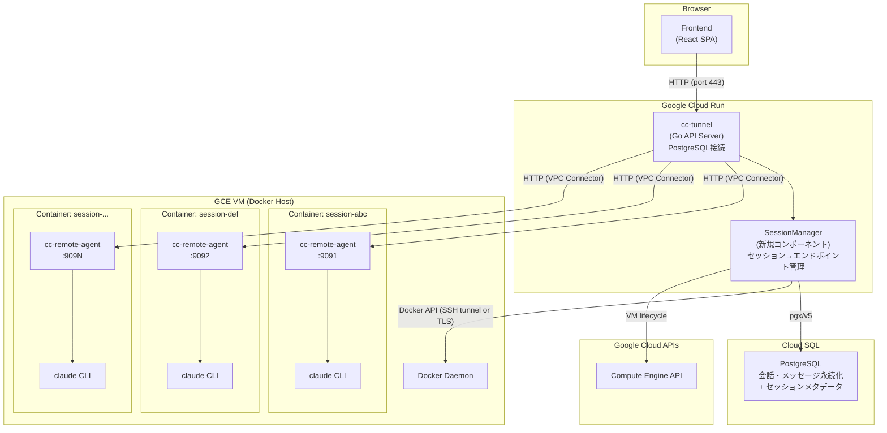
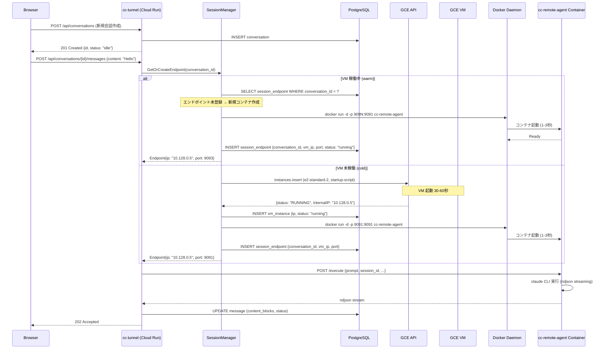

# Session Isolation Architecture Design

## 1. 背景と目標

### 現行アーキテクチャ

```
Browser → frontend (nginx) → cc-tunnel (Go, Cloud Run) → cc-remote-agent (Go, 単一インスタンス) → claude CLI
```

現在、cc-remote-agent は単一コンテナとして稼働し、全会話セッションが同一プロセス空間を共有している。
これにより以下の問題がある:

- **隔離性なし**: あるセッションの `claude` CLI 実行が他セッションに影響しうる（リソース競合、プロセス干渉）
- **スケーラビリティ制約**: 単一インスタンスの CPU/メモリが上限
- **セキュリティ**: セッション間でファイルシステムを共有（`/home/user/.claude`）

### 目標

会話セッションごとに独立した計算リソース（cc-remote-agent 実行環境）を割り当て、
セッション間の完全な隔離を実現する。

### 現行コードの主要な制約

| コンポーネント | 現行実装 | セッション隔離への影響 |
|---|---|---|
| `cc-tunnel/internal/remoteclient/client.go` | `Client.baseURL` が固定1つの cc-remote-agent URL | **変更必須**: セッションごとに異なるエンドポイントにルーティングする仕組みが必要 |
| `cc-tunnel/cmd/cc-tunnel/main.go` | `-agent-url` フラグで単一 URL を指定 | **変更必須**: セッションマネージャに置き換え |
| `cc-remote-agent/internal/auth/manager.go` | インメモリ `AuthManager`（プロセス内 singleton） | 各セッション環境で独立した認証状態が必要。または cc-tunnel 側で一元管理 |
| `cc-remote-agent/Dockerfile` | `npm install -g @anthropic-ai/claude-code` をイメージに焼き込み | セッション環境のベースイメージとして再利用可能 |
| `cc-tunnel/internal/api/handler.go` | `Server.remote` が単一 `remoteClient` | **変更必須**: per-session client routing |

## 2. 3案比較

### 案1: Docker on GCE

**概要**: GCE VM 上で Docker を実行し、1会話 = 1 Docker コンテナ。

```
cc-tunnel (Cloud Run)
  ↓ HTTP (VPC Connector → Internal IP)
GCE VM (Docker Host)
  ├── container-session-abc (cc-remote-agent:9091) → claude CLI
  ├── container-session-def (cc-remote-agent:9092) → claude CLI
  └── container-session-ghi (cc-remote-agent:9093) → claude CLI
```

**ライフサイクル**:
- **コンテナ**: 会話開始時に `docker run` で作成。idle 15分 or 会話終了で `docker rm`。
- **GCE VM**: 最初のコンテナ要求時に `gcloud compute instances create`。全コンテナ削除後に VM も削除。

**起動速度**:
- Docker コンテナ起動: **1-3秒**（イメージが VM にキャッシュ済みの場合）
- GCE VM コールドスタート: **30-60秒**（初回のみ。以降はコンテナ起動のみ）
- 実効起動時間: **1-3秒**（VM 稼働中）/ **30-60秒**（VM 未稼働時）

**コスト**:
- GCE e2-standard-2 (2 vCPU, 8GB): $0.067/hr ($1.61/day)
- 同時10セッション想定: 1 VM で対応可能 → **$1.61/day**
- アイドル時: 全セッション終了後 VM 自動削除 → **$0**
- Claude CLI 自体の API コストは別（Anthropic API 課金）

**隔離性**:
- Linux namespaces + cgroups によるプロセス・ファイルシステム隔離
- Docker network で通信隔離可能
- VM レベルの隔離ではないため、カーネル脆弱性には弱い
- **実用上十分**: Claude CLI は信頼済みコードの実行のみ

**運用複雑度**: 中
- GCE VM のプロビジョニング/デプロビジョニング自動化が必要
- Docker デーモン管理（イメージ pull、ディスク管理）
- ポート割り当て管理（動的ポートマッピング）

**スケーラビリティ**:
- 1 VM あたり 10-20 セッション（メモリ依存。claude CLI 1プロセス ≈ 200-500MB）
- VM 複数台で水平スケール可能だが、VM 間のセッション配分ロジックが必要

### 案2: GCE per session

**概要**: 1会話 = 1 GCE VM。最も単純で最も強力な隔離。

```
cc-tunnel (Cloud Run)
  ├─ HTTP → GCE VM session-abc (cc-remote-agent:9091) → claude CLI
  ├─ HTTP → GCE VM session-def (cc-remote-agent:9091) → claude CLI
  └─ HTTP → GCE VM session-ghi (cc-remote-agent:9091) → claude CLI
```

**ライフサイクル**:
- **GCE VM**: 会話開始時に `gcloud compute instances create`。idle 15分 or 会話終了で `gcloud compute instances delete`。

**起動速度**:
- GCE VM 起動: **30-60秒**（カスタムイメージ使用でも同等）
- Spot VM: さらに起動待ちが発生しうる
- **毎回の会話開始が 30-60秒待ち**: UX として致命的

**コスト**:
- GCE e2-medium (1 vCPU, 4GB) per session: $0.034/hr
- 同時10セッション: $0.34/hr ($8.16/day)
- **案1の 5倍のコスト**（同一負荷比較）
- Spot VM で 60-70% 削減可能だが、preemption リスクあり

**隔離性**:
- **最強**: VM レベルの完全隔離（独立カーネル、独立ネットワーク）
- コンプライアンス要件が厳しい場合に有利

**運用複雑度**: 低〜中
- Docker 層不要（VM に直接 cc-remote-agent をデプロイ）
- ただし VM の起動/停止自動化は必要
- カスタムイメージの定期更新（claude CLI バージョンアップ）

**スケーラビリティ**:
- 線形スケール（セッション数 = VM 数）
- GCE のクォータ制限に注意（デフォルト 24 CPUs/リージョン）

### 案3: GKE Autopilot (Pod per session)

**概要**: GKE Autopilot 上で 1会話 = 1 Pod。ノード管理は Google が自動で行う。

```
cc-tunnel (Cloud Run)
  ↓ HTTP (VPC Connector → ClusterIP Service or direct Pod IP)
GKE Autopilot Cluster
  ├── pod/session-abc (cc-remote-agent) → claude CLI
  ├── pod/session-def (cc-remote-agent) → claude CLI
  └── pod/session-ghi (cc-remote-agent) → claude CLI
```

**ライフサイクル**:
- **Pod**: 会話開始時に `kubectl create` (or Kubernetes API)。idle 15分で削除。
- **Cluster**: 常時稼働（Autopilot は Pod がゼロでも管理料がかかる）
- TTL Controller または CronJob でアイドル Pod 削除

**起動速度**:
- Pod スケジュール（ノード利用可能時）: **5-15秒**
- ノード新規プロビジョニング要: **30-120秒**
- Autopilot はワークロード不在時にノードをゼロにしうるため、初回起動は遅い
- **実効起動時間: 5-120秒**（ばらつき大）

**コスト**:
- Autopilot 管理料: $0.10/hr/cluster ($72/month、Pod ゼロでも発生)
- Pod リソース: vCPU $0.036/hr + Memory $0.004/GB/hr
- 1 Pod (0.5 vCPU, 1GB): $0.022/hr
- 同時10セッション: $0.22/hr + $0.10/hr = $0.32/hr ($7.68/day)
- **案1 と同等〜やや高**（クラスタ管理料の固定費あり）
- 常時稼働クラスタが不要な場合、固定費が痛い

**隔離性**:
- Pod レベル（namespaces + cgroups）→ 案1 と同等
- Kubernetes NetworkPolicy でより精密なネットワーク隔離可能
- Pod Security Standards で権限制限可能

**運用複雑度**: 高
- GKE Autopilot クラスタの初期構築・保守
- Pod ライフサイクル管理（カスタムコントローラー or CronJob）
- Kubernetes API を cc-tunnel から呼び出す実装
- RBAC 設定、ネットワークポリシー、Pod Security Policy
- クラスタのバージョンアップ運用

**スケーラビリティ**:
- **最強**: Autopilot がノードを自動スケール
- Kubernetes HPA/VPA 統合可能
- 理論上数百セッションまで透過的にスケール

## 3. 比較マトリクス

| 評価軸 | 案1: Docker on GCE | 案2: GCE per session | 案3: GKE Autopilot |
|--------|:---:|:---:|:---:|
| **起動速度** | **1-3秒** (VM稼働時) | 30-60秒 | 5-120秒 |
| **コスト (10並行)** | **$1.61/day** | $8.16/day | $7.68/day |
| **隔離性** | コンテナ (十分) | **VM (最強)** | コンテナ (十分) |
| **運用複雑度** | 中 | **低〜中** | 高 |
| **スケーラビリティ** | 中 (VM追加要) | 低 (線形増) | **高 (自動)** |
| **UX (初回体験)** | 30-60秒 (VM起動) | 30-60秒 | 30-120秒 |
| **UX (定常利用)** | **1-3秒** | 30-60秒 | 5-15秒 |
| **実装工数** | 中 | **小** | 大 |
| **アイドルコスト** | **$0** (VM削除) | **$0** (VM削除) | $72/月 (クラスタ管理料) |

## 4. 推奨案: 案1 (Docker on GCE)

### 選定根拠

1. **起動速度が圧倒的に速い**: VM 稼働中であればコンテナ起動 1-3秒。会話開始時のレイテンシを最小化できる。
   案2・案3はいずれも 30秒以上の待ちが定常的に発生する。

2. **コスト効率が最も高い**: 複数セッションを1 VM に集約するため、案2の 1/5、案3のクラスタ管理料不要。
   アイドル時は VM ごと削除して $0。

3. **隔離性は実用上十分**: cc-remote-agent が実行する claude CLI は Anthropic 公式ツール。
   悪意あるコード実行のリスクは低く、コンテナレベルの隔離で十分。
   VM レベル隔離（案2）は過剰。

4. **実装工数が適度**: GKE の Kubernetes 知識・運用コスト（案3）は不要。
   GCE + Docker API という慣れた技術スタックで実現できる。

5. **将来の移行パスが明確**: 負荷増大時に GKE Autopilot（案3）への移行が容易。
   コンテナイメージはそのまま再利用可能。

### リスクと対策

| リスク | 影響 | 対策 |
|---|---|---|
| VM コールドスタート (30-60秒) | 長時間アイドル後の初回会話が遅い | Warm pool: 最低1台の VM を常時待機（e2-micro: $0.008/hr = $5.76/月） |
| Docker デーモン障害 | 全セッション停止 | VM ヘルスチェック + 自動再作成。複数 VM で冗長化。 |
| ポート枯渇 | 1 VM あたりのセッション数上限 | 動的ポート割り当て（9091-9200）。上限到達時に新 VM 作成。 |
| GCE API レート制限 | VM 作成/削除が集中するとスロットリング | バッチ処理、exponential backoff |

## 5. 推奨案の詳細アーキテクチャ

### C4 Level 2 — Container Diagram



### コンポーネント詳細

#### SessionManager (新規)

cc-tunnel に追加する中核コンポーネント。セッションのライフサイクル全体を管理する。

```
internal/
  sessionmanager/
    manager.go          # SessionManager 本体
    provisioner.go      # GCE VM + Docker コンテナのプロビジョニング
    healthcheck.go      # ヘルスチェック + idle 検出
    types.go            # SessionEndpoint, VMInfo 等の型定義
```

**責務**:
1. 会話 → cc-remote-agent エンドポイントのマッピング管理
2. GCE VM のプロビジョニング/デプロビジョニング
3. Docker コンテナの作成/削除
4. アイドル検出と自動クリーンアップ
5. エンドポイント情報の PostgreSQL 永続化

### 通信経路

```
cc-tunnel (Cloud Run)
  │
  │  Serverless VPC Access Connector
  │  (10.8.0.0/28 → VPC)
  │
  ├── Cloud SQL (Private IP)
  │     PostgreSQL 接続
  │
  └── GCE VM (Internal IP: 10.128.x.x)
        │
        ├── SSH tunnel (port 22) → Docker API
        │     コンテナ作成/削除/ポートマッピング確認
        │
        └── HTTP (port 9091-920N) → cc-remote-agent
              各コンテナの cc-remote-agent に直接アクセス
```

**VPC 構成**:
- Cloud Run → Serverless VPC Access Connector → 共有 VPC
- GCE VM は同一 VPC 内の Internal IP で通信
- ファイアウォールルール: Cloud Run connector subnet → GCE VM (tcp:22, tcp:9091-9200)

### Docker API アクセス方式

GCE VM 上の Docker デーモンへのアクセスには **SSH トンネル経由の Docker API** を使用する。

| 方式 | 利点 | 欠点 | 採用 |
|------|------|------|------|
| Docker API over TLS (tcp:2376) | 直接アクセス | TLS 証明書管理が複雑 | × |
| SSH トンネル | 既存の SSH 認証を活用、追加設定最小 | SSH 接続のオーバーヘッド | **○** |
| gcloud compute ssh | GCP IAM 認証を直接利用 | gcloud CLI 依存 | △ (フォールバック) |

**実装**: `docker -H ssh://user@<vm-internal-ip>` 形式、または Go の `docker/client` ライブラリに SSH ダイアラーを設定。

## 6. セッション開始時のリソース生成フロー

### シーケンス図



### API コール単位の詳細

**1. VM プロビジョニング** (初回のみ):
```
POST https://compute.googleapis.com/compute/v1/projects/{project}/zones/{zone}/instances
{
  "name": "cc-agent-vm-{random}",
  "machineType": "zones/{zone}/machineTypes/e2-standard-2",
  "disks": [{
    "initializeParams": {
      "sourceImage": "projects/{project}/global/images/cc-agent-base-v{N}"
    },
    "boot": true, "autoDelete": true
  }],
  "networkInterfaces": [{
    "subnetwork": "projects/{project}/regions/{region}/subnetworks/{subnet}",
    "accessConfigs": []  // No external IP
  }],
  "metadata": {
    "items": [{
      "key": "startup-script",
      "value": "#!/bin/bash\nsystemctl start docker\ndocker pull gcr.io/{project}/cc-remote-agent:latest"
    }]
  },
  "labels": {"purpose": "cc-tunnel-session"}
}
```

**2. コンテナ作成** (セッション開始ごと):
```bash
docker run -d \
  --name session-{conversation_id} \
  -p {dynamic_port}:9091 \
  -e ANTHROPIC_API_KEY=${ANTHROPIC_API_KEY} \
  --memory=512m \
  --cpus=0.5 \
  gcr.io/{project}/cc-remote-agent:latest
```

**3. コンテナ削除** (セッション終了/idle):
```bash
docker stop session-{conversation_id}
docker rm session-{conversation_id}
```

**4. VM 削除** (全コンテナ削除後):
```
DELETE https://compute.googleapis.com/compute/v1/projects/{project}/zones/{zone}/instances/{vm_name}
```

## 7. Idle 15分でのリソース自動削除メカニズム

### アーキテクチャ

```
SessionManager (cc-tunnel 内 goroutine)
  │
  ├── IdleChecker (60秒間隔)
  │     ├── DB: SELECT session_endpoints WHERE last_activity < NOW() - 15min
  │     ├── 該当セッション → Docker API: docker stop + docker rm
  │     └── DB: UPDATE session_endpoint SET status = 'terminated'
  │
  └── VMScaler (5分間隔)
        ├── DB: SELECT vm_instances WHERE active_containers = 0 AND idle_since < NOW() - 5min
        ├── 該当 VM → GCE API: instances.delete
        └── DB: UPDATE vm_instance SET status = 'terminated'
```

### last_activity の更新タイミング

| イベント | 更新元 |
|---|---|
| `POST /messages` (メッセージ送信) | cc-tunnel handler |
| `Execute` 完了 | cc-tunnel handler (goroutine) |
| `GET /conversations/{id}` (ポーリング) | cc-tunnel handler (会話が running の場合のみ) |

### DB スキーマ追加

```sql
-- セッションエンドポイント管理テーブル
CREATE TABLE session_endpoints (
    id UUID PRIMARY KEY DEFAULT gen_random_uuid(),
    conversation_id UUID NOT NULL REFERENCES conversations(id) ON DELETE CASCADE,
    vm_instance_id UUID NOT NULL REFERENCES vm_instances(id),
    container_name TEXT NOT NULL,
    port INTEGER NOT NULL,
    status TEXT NOT NULL DEFAULT 'provisioning',  -- provisioning | running | terminated
    last_activity TIMESTAMPTZ NOT NULL DEFAULT NOW(),
    created_at TIMESTAMPTZ NOT NULL DEFAULT NOW(),
    UNIQUE(conversation_id)
);

-- GCE VM 管理テーブル
CREATE TABLE vm_instances (
    id UUID PRIMARY KEY DEFAULT gen_random_uuid(),
    gce_instance_name TEXT NOT NULL UNIQUE,
    zone TEXT NOT NULL,
    internal_ip TEXT NOT NULL,
    status TEXT NOT NULL DEFAULT 'provisioning',  -- provisioning | running | terminated
    active_containers INTEGER NOT NULL DEFAULT 0,
    idle_since TIMESTAMPTZ,  -- active_containers が 0 になった時刻
    created_at TIMESTAMPTZ NOT NULL DEFAULT NOW()
);

CREATE INDEX idx_session_endpoints_conversation ON session_endpoints(conversation_id);
CREATE INDEX idx_session_endpoints_last_activity ON session_endpoints(last_activity) WHERE status = 'running';
CREATE INDEX idx_vm_instances_status ON vm_instances(status) WHERE status = 'running';
```

## 8. 全リソース削除後のコスト最適化

### VM 自動削除フロー

```
コンテナ削除イベント
  ↓
SessionManager: vm.active_containers -= 1
  ↓
active_containers == 0 ?
  ├── Yes → vm.idle_since = NOW()
  │         → VMScaler が 5分後に検知 → GCE API: instances.delete
  └── No  → 何もしない
```

### Warm Pool 戦略

完全にゼロにすると次回の VM 起動に 30-60秒かかる。
コスト最適化とレイテンシのバランスを取る設定:

| 設定 | 値 | 理由 |
|---|---|---|
| `warm_pool_size` | 0 (デフォルト) | 完全なコスト最適化。初回のみ待ち。 |
| `warm_pool_size` | 1 (推奨) | e2-micro ($5.76/月) を1台常時待機。初回レイテンシ解消。 |
| `vm_idle_grace_period` | 5分 | 短時間のアイドル後の再利用を許容 |
| `container_idle_timeout` | 15分 | 要件通り |

### 時間帯ベースのスケジュール (オプション)

Cloud Scheduler + Cloud Functions で時間帯に応じた warm pool 制御:
- 営業時間 (9:00-21:00 JST): `warm_pool_size = 1`
- 深夜 (21:00-9:00 JST): `warm_pool_size = 0`

## 9. セキュリティ考慮

### セッション間隔離

| 隔離レベル | 実装 |
|---|---|
| プロセス隔離 | Docker コンテナ (独立 PID namespace) |
| ファイルシステム隔離 | コンテナごとに独立した `/home/user/.claude` (ephemeral volume) |
| ネットワーク隔離 | `--network=none` or 専用 Docker network。コンテナ間通信禁止。 |
| リソース隔離 | `--memory=512m --cpus=0.5` でリソース制限 |

### 認証・認可

| 対象 | 方式 |
|---|---|
| Browser → cc-tunnel | 既存の認証フロー（OAuth via cc-remote-agent）を cc-tunnel 側に移行。セッション環境ではなく cc-tunnel が認証状態を管理。 |
| cc-tunnel → GCE VM | VPC 内部通信 + ファイアウォールルール (source: VPC connector subnet, target: GCE VM tag) |
| cc-tunnel → Docker API | SSH 鍵認証 (GCE メタデータ or Secret Manager) |
| コンテナ → Anthropic API | `ANTHROPIC_API_KEY` を環境変数で注入。Secret Manager から取得。 |

### 追加のセキュリティ対策

1. **コンテナイメージの署名**: Artifact Registry + Binary Authorization で検証済みイメージのみ実行
2. **Secret Manager**: API キーは GCE VM のメタデータではなく Secret Manager から取得
3. **VPC Service Controls**: Cloud Run → GCE VM 間の通信を VPC 内に閉じる
4. **監査ログ**: Cloud Audit Logs で VM 作成/削除を記録
5. **`--dangerously-skip-permissions`**: 現行通りコンテナ内で使用（非 root ユーザー実行）

## 10. 既存コードへの変更影響範囲

### 変更が必要なファイル

| ファイル | 変更内容 | 影響度 |
|---|---|---|
| `apps/cc-tunnel/cmd/cc-tunnel/main.go` | `-agent-url` を廃止。SessionManager の初期化を追加。IdleChecker/VMScaler goroutine を起動。 | **大** |
| `apps/cc-tunnel/internal/api/handler.go` | `Server.remote` を `Server.sessionMgr` に変更。`SendMessage()` 内で `sessionMgr.GetOrCreateEndpoint()` を呼び、動的に `remoteclient.Client` を生成。 | **大** |
| `apps/cc-tunnel/internal/api/interfaces.go` | `sessionManager` インターフェースを追加 | **小** |
| `apps/cc-tunnel/internal/remoteclient/client.go` | 変更なし（per-session で new する形で再利用） | **なし** |
| `apps/cc-tunnel/internal/db/repository.go` | `session_endpoints`, `vm_instances` テーブルの CRUD メソッドを追加 | **中** |
| `apps/cc-tunnel/internal/db/migrations/` | 新規マイグレーション追加 (session_endpoints, vm_instances) | **小** |
| `apps/cc-remote-agent/` | 変更なし（コンテナイメージとしてそのまま利用） | **なし** |
| `apps/compose.yaml` | ローカル開発用に `cc-remote-agent` の複数インスタンス起動設定を追加（オプション） | **小** |

### 新規追加ファイル

```
apps/cc-tunnel/internal/
  sessionmanager/
    manager.go          # SessionManager 本体 (GetOrCreateEndpoint, Cleanup)
    provisioner.go      # GCE VM + Docker コンテナ操作
    healthcheck.go      # IdleChecker + VMScaler goroutine
    types.go            # SessionEndpoint, VMInstance 型
    manager_test.go     # テスト
```

### 変更しないファイル

| ファイル | 理由 |
|---|---|
| `apps/cc-remote-agent/` 全体 | コンテナイメージとしてそのまま利用。コード変更不要。 |
| `apps/frontend/` 全体 | フロントエンドから見たAPI は変わらない（会話の開始が少し遅くなるだけ） |
| `apps/openapi/openapi.yaml` | 外部 API は変更なし |

### 認証フローの変更

現行: Browser → cc-tunnel → **単一の cc-remote-agent** で `claude /auth` 実行
変更後: cc-remote-agent はセッションごとに動的に生成されるため、認証フローを再設計する必要がある。

**案A: 認証専用コンテナ**
- 認証用の永続的な cc-remote-agent コンテナを1つ維持
- 認証完了後、credentials を Secret Manager or 共有ボリュームに保存
- セッションコンテナ起動時に credentials をマウント

**案B: API キー認証に統一**
- Anthropic API Key を直接使用（OAuth フロー不要）
- 最も単純だが、ユーザーが API Key を持っている前提

**推奨: 案A** — 既存の OAuth フローを活かしつつ、credentials を共有する。

## 11. 実装フェーズ

### Phase 1: 基盤 (1-2週間)
- DB マイグレーション (session_endpoints, vm_instances)
- SessionManager 基本実装 (GetOrCreateEndpoint, ReleaseEndpoint)
- GCE VM プロビジョニング (Compute Engine API)
- Docker コンテナ管理 (SSH 経由)

### Phase 2: 統合 (1週間)
- handler.go の改修 (per-session routing)
- main.go の改修 (SessionManager 初期化)
- IdleChecker + VMScaler goroutine

### Phase 3: 認証・セキュリティ (1週間)
- 認証フローの再設計 (認証専用コンテナ or API Key)
- Secret Manager 統合
- ファイアウォールルール設定
- VPC Connector 構成

### Phase 4: 運用 (1週間)
- Warm pool 実装
- Cloud Monitoring ダッシュボード
- アラート設定 (VM 数、コンテナ数、エラー率)
- ローカル開発環境の整備 (compose.yaml 更新)
