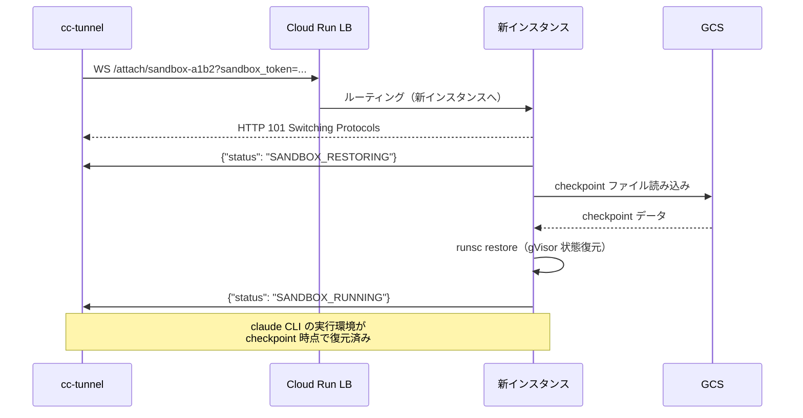

# Cloud Run Sandbox 方式 詳細設計書

## 1. 概要と位置づけ

### 背景

cc-tunnel のセッション隔離方式として、先行して Docker on GCE 方式（`docs/docker-gce-design.md`）を設計した。
本設計書は、Google の OSS プロジェクト [cloud-run-sandbox](https://github.com/GoogleCloudPlatform/cloud-run-sandbox) を活用した**第2の実行方式**を定義する。

### Cloud Run Sandbox 方式の概要

Cloud Run Sandbox は、Cloud Run 上で gVisor（`runsc`）による隔離された実行環境を提供するサービスである。
WebSocket API 経由でサンドボックスの作成・コマンド実行・stdin/stdout ストリーミングを行う。

主要機能:
- **gVisor 隔離**: Linux syscall をインターセプトするゲストカーネルにより、ホストカーネルとの攻撃面を最小化
- **Checkpoint/Restore**: gVisor の状態（プロセス・メモリ・ファイルシステム）を GCS に永続化し、別インスタンスで復元
- **Filesystem Snapshot**: 実行中サンドボックスのファイルシステムを GCS にスナップショット保存し、新サンドボックスのテンプレートとして再利用
- **セッションアフィニティ**: `--concurrency=1 --session-affinity` により 1 WebSocket = 1 インスタンスを保証

### Docker on GCE 方式との対比

| 観点 | Docker on GCE | Cloud Run Sandbox |
|------|--------------|-------------------|
| 用途 | 高スループット・多セッション並行 | 強隔離・セッション永続化・高速起動 |
| 隔離 | Docker コンテナ（namespaces + cgroups） | gVisor（ゲストカーネル）= より強固 |
| セッション永続化 | なし（コンテナ削除で消失） | Checkpoint/Restore で GCS に保存・復元可能 |
| 環境複製 | Docker イメージ pull（数秒） | Filesystem Snapshot から即座にクローン |
| 通信 | HTTP（remoteclient → cc-remote-agent） | WebSocket（cc-tunnel → sandbox exec API） |
| インフラ管理 | GCE VM + Docker デーモンの管理が必要 | Cloud Run がインフラ管理を自動化 |

### 活用方針

本設計では、Cloud Run Sandbox を「Docker on GCE の代替」ではなく「補完」として位置づける。
ユーザーが会話作成時に `execution_mode` を選択し、SessionProvider インターフェースで両方式を透過的に切り替える。

---

## 2. アーキテクチャ全体像

### Before / After

**Before（現行）**:

```
Browser → frontend (nginx) → cc-tunnel (Cloud Run)
                                  ↓ HTTP (固定 URL: -agent-url フラグ)
                             cc-remote-agent (単一インスタンス)
                                  ↓ exec
                             claude CLI (全セッション共有)
```

**After（Cloud Run Sandbox 方式）**:

```
Browser → frontend (nginx) → cc-tunnel (Cloud Run)
                                  ├── 認証専用 cc-remote-agent (固定1台)
                                  │
                                  └── SandboxManager
                                           ↓ WebSocket (VPC内部通信)
                                       Cloud Run Sandbox サービス
                                           ├── sandbox-{conv_abc} [gVisor] claude CLI
                                           ├── sandbox-{conv_def} [gVisor] claude CLI
                                           └── sandbox-{conv_...} [gVisor] claude CLI
```

### 通信経路（全体像）

```
cc-tunnel (Cloud Run, region: asia-northeast1)
  │
  ├── Cloud SQL (Private IP, pgx/v5)
  │
  ├── 認証専用 cc-remote-agent (HTTP, 固定)
  │
  └── Cloud Run Sandbox サービス (同一 VPC)
        │  WebSocket wss:// (Cloud Run 内部 URL)
        │  --concurrency=1 --session-affinity
        │
        ├── Instance A: sandbox-{conv_abc}
        │     └── [gVisor] claude CLI → Anthropic API (HTTPS)
        │
        ├── Instance B: sandbox-{conv_def}
        │     └── [gVisor] claude CLI → Anthropic API (HTTPS)
        │
        └── (Cloud Run が自動スケール)
```

### Cloud Run Sandbox サービスのデプロイ

```bash
PROJECT_ID=<YOUR_PROJECT_ID>
BUCKET_NAME=<YOUR_BUCKET_NAME>

gcloud run deploy cc-tunnel-sandbox \
  --image=REGION-docker.pkg.dev/${PROJECT_ID}/cc-tunnel/sandbox:latest \
  --region=asia-northeast1 \
  --no-allow-unauthenticated \
  --execution-environment=gen2 \
  --cpu 2 \
  --memory 4Gi \
  --concurrency=1 \
  --session-affinity \
  --add-volume=name=gcs-volume,type=cloud-storage,mount-options="metadata-cache-ttl-secs=0",bucket=${BUCKET_NAME} \
  --add-volume-mount=volume=gcs-volume,mount-path=/mnt/gcs \
  --set-env-vars="SANDBOX_METADATA_MOUNT_PATH=/mnt/gcs" \
  --set-env-vars="SANDBOX_METADATA_BUCKET=${BUCKET_NAME}" \
  --set-env-vars="SANDBOX_CHECKPOINT_MOUNT_PATH=/mnt/gcs" \
  --set-env-vars="SANDBOX_CHECKPOINT_BUCKET=${BUCKET_NAME}" \
  --set-env-vars="FILESYSTEM_SNAPSHOT_MOUNT_PATH=/mnt/gcs" \
  --set-env-vars="FILESYSTEM_SNAPSHOT_BUCKET=${BUCKET_NAME}" \
  --project=${PROJECT_ID}
```

**カスタムイメージ要件**:
- ベース: cloud-run-sandbox の公式イメージ
- 追加: `claude` CLI のインストール（`npm install -g @anthropic-ai/claude-code`）
- 追加: ANTHROPIC_API_KEY は Secret Manager から注入（環境変数として設定）

---

## 3. コンポーネント詳細

### 3.1 Cloud Run Sandbox の役割と cc-remote-agent との関係

Cloud Run Sandbox は **cc-remote-agent の代替** として機能する。

| 機能 | cc-remote-agent | Cloud Run Sandbox |
|------|----------------|-------------------|
| claude CLI 実行 | PTY/exec で起動、HTTP API でラップ | gVisor sandbox 内で bash exec |
| 入出力 | HTTP リクエスト/NDJSON レスポンス | WebSocket stdin/stdout ストリーミング |
| 隔離 | なし（プロセス共有） | gVisor（プロセス・FS・ネットワーク隔離） |
| 状態永続化 | なし | Checkpoint/Restore（GCS） |
| 認証 | OAuth PTY フロー（`claude /auth`） | **非対応**（認証は固定 cc-remote-agent が担当） |

**Sandbox 方式での claude CLI 実行フロー**:

```
cc-tunnel (SandboxManager)
  │
  │  WebSocket: {"language": "bash", "code": "claude --print --output-format stream-json --model claude-sonnet-4-6 --session-id abc123 \"ユーザーのプロンプト\""}
  │
  ↓
Cloud Run Sandbox (gVisor 内)
  │
  │  bash exec: claude --print --output-format stream-json ...
  │
  ↓  stdout → WebSocket: {"event": "stdout", "data": "{\"type\":\"assistant\",...}\n"}
  │  stderr → WebSocket: {"event": "stderr", "data": "..."}
  │
cc-tunnel: stdout イベントを NDJSON としてパース → DB 保存
```

cc-remote-agent の `Execute` API が返す NDJSON ストリームと、Cloud Run Sandbox の stdout ストリームは等価。
cc-tunnel 側で stdout イベントの `data` フィールドを NDJSON 行として処理すれば、既存の `SendMessage()` ロジック（content_blocks 構築、バッチ DB 保存）をそのまま再利用できる。

### 3.2 SandboxManager（cc-tunnel 側新規コンポーネント）

`apps/cc-tunnel/internal/sandboxmanager/` に新規パッケージとして追加する。

#### 責務

1. Cloud Run Sandbox サービスへの WebSocket 接続管理
2. 会話ID → サンドボックスID のマッピング管理
3. サンドボックスの作成・アタッチ・キル
4. claude CLI コマンドの構築と exec 実行
5. stdout/stderr イベントの NDJSON パース
6. Checkpoint/Restore の管理
7. Filesystem Snapshot の管理
8. Idle 検知と自動 checkpoint/削除

#### パッケージ構成

```
apps/cc-tunnel/internal/sandboxmanager/
├── manager.go        # SandboxManager 本体
├── wsclient.go       # WebSocket クライアント（gorilla/websocket）
├── executor.go       # claude CLI 実行・NDJSON パーサー
├── checkpoint.go     # Checkpoint/Restore 管理
├── types.go          # SandboxSession, Config 型定義
└── manager_test.go   # ユニットテスト
```

#### 主要メソッド

```go
// SandboxManager: Cloud Run Sandbox 方式のセッション管理
type SandboxManager struct {
    sandboxURL  string              // Cloud Run Sandbox サービスの WebSocket URL
    repo        sandboxRepository   // DB CRUD
    sessions    map[string]*SandboxSession // conversationID → session
    mu          sync.Mutex
    config      SandboxConfig
}

// Execute: claude CLI を sandbox 内で実行し、NDJSON イベントをコールバックで通知
func (m *SandboxManager) Execute(
    ctx context.Context,
    conversationID string,
    req ExecuteRequest,
    callback StreamCallback,
) (sessionID string, err error)

// CheckpointSession: 会話のサンドボックス状態を GCS に checkpoint
func (m *SandboxManager) CheckpointSession(ctx context.Context, conversationID string) error

// RestoreSession: GCS から会話のサンドボックス状態を restore
func (m *SandboxManager) RestoreSession(ctx context.Context, conversationID string) error
```

### 3.3 Checkpoint/Restore 活用設計（セッション継続）

Cloud Run Sandbox の checkpoint/restore は、cc-tunnel のセッション隔離に以下の利点をもたらす:

1. **セッション永続化**: アイドルセッションを checkpoint → Cloud Run インスタンス解放 → コスト $0
2. **セッション復帰**: ユーザーが戻ってきたら restore → 実行環境がそのまま復元
3. **インスタンスハンドオフ**: Cloud Run インスタンスが再スケジュールされても、GCS 経由で透過的に移行

**checkpoint 取得タイミング**:

| タイミング | トリガー | 実装 |
|-----------|---------|------|
| claude CLI 実行完了後 | `SANDBOX_EXECUTION_DONE` イベント受信 | SandboxManager が自動で checkpoint |
| アイドルタイムアウト直前 | `idle_timeout` 経過 | Cloud Run Sandbox の `enable_idle_timeout_auto_checkpoint` |
| 明示的なセッション保存 | ユーザーアクション（将来拡張） | `{"action": "checkpoint"}` 送信 |

**restore からの起動フロー**:

```
ユーザーが既存会話にメッセージ送信
  ↓
SandboxManager.Execute(conversationID, ...)
  ↓
DB: SELECT sandbox_sessions WHERE conversation_id = ?
  ↓ sandbox_id 取得
  ↓
WebSocket: /attach/{sandbox_id}?sandbox_token={token}
  ↓
Cloud Run Sandbox:
  - ローカルにサンドボックスあり → 即座に SANDBOX_RUNNING
  - ローカルになし → GCS から restore → SANDBOX_RUNNING
  ↓
claude CLI 実行（gVisor 環境が checkpoint 時点の状態で復元済み）
```

### 3.4 Filesystem Snapshot 活用設計（高速環境複製）

Filesystem Snapshot は、claude CLI + 依存パッケージがインストール済みの「テンプレート環境」を作成するために使用する。

**セットアップフロー（1回だけ実行）**:

```bash
# 1. テンプレート用サンドボックスを作成
sandbox = await Sandbox.create(url, { idleTimeout: 600 })

# 2. claude CLI + 依存パッケージをインストール（初回のみ）
await sandbox.exec("bash", "npm install -g @anthropic-ai/claude-code")

# 3. filesystem snapshot を作成
await sandbox.snapshotFilesystem("cc-tunnel-base-v1")

# 4. テンプレート用サンドボックスを破棄
sandbox.kill()
```

**通常のサンドボックス作成（snapshot 利用）**:

```json
{
  "idle_timeout": 900,
  "enable_checkpoint": true,
  "enable_idle_timeout_auto_checkpoint": true,
  "filesystem_snapshot_name": "cc-tunnel-base-v1"
}
```

→ claude CLI インストール済みの環境が即座に利用可能（インストール待ちなし）。

ただし、カスタム Docker イメージに claude CLI をプリインストールする方式（§2）の方が簡潔であり、filesystem snapshot はイメージ更新なしで環境を変更したい場合の補助手段として位置づける。

---

## 4. 通信経路

### 4.1 WebSocket API の利用方法

Cloud Run Sandbox は以下の 2 つの WebSocket エンドポイントを提供する:

| エンドポイント | 用途 | cc-tunnel での利用 |
|--------------|------|-------------------|
| `WS /create` | 新規サンドボックス作成 | 新規会話の初回メッセージ送信時 |
| `WS /attach/{sandbox_id}?sandbox_token={token}` | 既存サンドボックスへの接続 | 既存会話へのメッセージ送信時（restore 含む） |

**WebSocket メッセージフロー（新規セッション）**:

```
cc-tunnel → Cloud Run Sandbox:
  1. WebSocket 接続: wss://<SANDBOX_URL>/create
  2. 初期化メッセージ:
     {"idle_timeout": 900, "enable_checkpoint": true, "enable_idle_timeout_auto_checkpoint": true, "filesystem_snapshot_name": "cc-tunnel-base-v1"}

Cloud Run Sandbox → cc-tunnel:
  3. {"event": "status_update", "status": "SANDBOX_CREATING"}
  4. {"event": "sandbox_id", "sandbox_id": "sandbox-a1b2", "sandbox_token": "deadbeef..."}
  5. {"event": "status_update", "status": "SANDBOX_RUNNING"}

cc-tunnel → Cloud Run Sandbox:
  6. {"language": "bash", "code": "claude --print --output-format stream-json --model claude-sonnet-4-6 --session-id '' --prompt 'Hello'"}

Cloud Run Sandbox → cc-tunnel:
  7. {"event": "status_update", "status": "SANDBOX_EXECUTION_RUNNING"}
  8. {"event": "stdout", "data": "{\"type\":\"assistant\",\"message\":{...}}\n"}
  9. {"event": "stdout", "data": "{\"type\":\"result\",\"session_id\":\"abc123\",...}\n"}
  10. {"event": "status_update", "status": "SANDBOX_EXECUTION_DONE"}
```

**WebSocket メッセージフロー（既存セッションへの再接続）**:

```
cc-tunnel → Cloud Run Sandbox:
  1. WebSocket 接続: wss://<SANDBOX_URL>/attach/sandbox-a1b2?sandbox_token=deadbeef...

Cloud Run Sandbox → cc-tunnel:
  2. {"event": "status_update", "status": "SANDBOX_RESTORING"}  ← GCS から restore 中
     または
     {"event": "status_update", "status": "SANDBOX_RUNNING"}    ← ローカルにあり

cc-tunnel → Cloud Run Sandbox:
  3. {"language": "bash", "code": "claude --print --output-format stream-json --session-id abc123 --resume --prompt '次の質問'"}
```

### 4.2 セッションアフィニティの設定

Cloud Run Sandbox は `--concurrency=1 --session-affinity` でデプロイする。

- **`--concurrency=1`**: 1 インスタンス = 1 WebSocket = 1 サンドボックス。排他利用を保証。
- **`--session-affinity`**: Cloud Run LB が `GAESA` クッキーで同一インスタンスにルーティング。再接続時に同一インスタンスに到達しやすくする。
- **アフィニティミス時**: Checkpoint/Restore で透過的にハンドオフ（lifecycle.md §6.3）。

### 4.3 cc-remote-agent コマンド実行のマッピング

| cc-remote-agent API | Cloud Run Sandbox 対応 |
|---------------------|----------------------|
| `POST /execute` (prompt, session_id, model) | `exec("bash", "claude --print --output-format stream-json ...")` |
| `POST /auth/login` | 非対応（認証は固定 cc-remote-agent） |
| `GET /auth/status` | 非対応（認証は固定 cc-remote-agent） |
| `POST /auth/input` | 非対応 |
| `GET /auth/output` | 非対応 |

**claude CLI コマンド構築**:

```go
func buildClaudeCommand(req ExecuteRequest) string {
    args := []string{
        "claude",
        "--print",
        "--output-format", "stream-json",
        "--model", req.Model,
    }
    if req.SessionID != "" {
        args = append(args, "--session-id", req.SessionID, "--resume")
    }
    // プロンプトは stdin 経由で渡す（コマンドライン引数にするとエスケープ問題がある）
    // → 代替: echo + pipe
    cmd := fmt.Sprintf("echo %s | %s",
        shellescape(req.Prompt),
        strings.Join(args, " "),
    )
    return cmd
}
```

**注意**: プロンプト内の特殊文字（引用符、バックスラッシュ等）のエスケープに注意が必要。
安全のため、stdin 経由でプロンプトを渡すアプローチが推奨される:

```go
// exec 開始後に stdin でプロンプトを送信
sandbox.exec("bash", "claude --print --output-format stream-json --model claude-sonnet-4-6")
// ↓ 直後に stdin メッセージ
sandbox.sendStdin(req.Prompt + "\n")
```

---

## 5. Sandbox ライフサイクル管理

### 5.1 生成（初回メッセージ時）

```
POST /api/conversations/{id}/messages
  ↓
handler.SendMessage()
  ↓
sessionProvider.Execute(ctx, conversationID, req, callback)
  ↓
SandboxManager: DB に sandbox_session レコードなし
  ↓
WebSocket /create → sandbox 作成（1-3秒: snapshot 利用時）
  ↓
sandbox_id, sandbox_token を DB に保存
  ↓
exec: claude CLI 実行
  ↓
stdout → NDJSON パース → callback → DB 保存
```

### 5.2 通信（2回目以降のメッセージ）

```
POST /api/conversations/{id}/messages
  ↓
SandboxManager: DB に sandbox_session レコードあり
  ↓
WebSocket /attach/{sandbox_id}?sandbox_token={token}
  ↓ SANDBOX_RUNNING (ローカルにあり) or SANDBOX_RESTORING → SANDBOX_RUNNING (GCS から restore)
  ↓
exec: claude CLI 実行（--session-id, --resume）
  ↓
stdout → NDJSON パース → callback → DB 保存
  ↓
exec 完了 → checkpoint（自動）
```

### 5.3 Idle 検知

Cloud Run Sandbox には組み込みの idle timeout 機能がある:
- `idle_timeout`: 初期化メッセージで設定（秒数）
- SandboxManager の cleanup_loop が 10秒間隔でチェック
- `last_activity` はコマンド実行・WebSocket メッセージ送受信時に自動更新

cc-tunnel 側のアイドル管理:

| レベル | タイムアウト | アクション |
|--------|-----------|-----------|
| WebSocket 接続切断 | メッセージ完了後即座 | WebSocket を閉じてインスタンス解放（checkpoint 済み） |
| サンドボックス idle | 15分（`idle_timeout: 900`） | Cloud Run Sandbox が自動 checkpoint → インスタンス削除 |
| DB レコード保持 | 無期限 | sandbox_session レコードは保持（restore 用） |

**cc-tunnel 側の WebSocket 接続管理戦略**:

Docker on GCE ではコンテナが常時稼働していたが、Cloud Run Sandbox では**メッセージ処理中のみ WebSocket を接続**する方式を推奨する:

1. メッセージ受信 → WebSocket 接続（`/create` or `/attach`）
2. claude CLI 実行
3. 実行完了 → checkpoint（オプション） → WebSocket 切断
4. 次のメッセージまで Cloud Run インスタンスは idle（自動スケールダウン）

これにより、アイドル中のコスト = $0（Cloud Run は idle インスタンスの CPU 課金なし）。

### 5.4 破棄

| トリガー | アクション |
|---------|-----------|
| 会話削除（ユーザーアクション） | cc-tunnel → WebSocket `/attach` → `kill_sandbox` → DB 削除 |
| サンドボックス idle timeout | Cloud Run Sandbox が自動 checkpoint → ローカル削除（GCS に状態保持） |
| 明示的な破棄（管理用） | cc-tunnel → `kill_sandbox` → GCS のメタデータも削除 |

---

## 6. Checkpoint/Restore によるセッション継続

### 6.1 Checkpoint 取得タイミング

| タイミング | 条件 | 実装 |
|-----------|------|------|
| claude CLI 実行完了後 | `SANDBOX_EXECUTION_DONE` 受信 | SandboxManager が `{"action": "checkpoint"}` 送信 |
| アイドルタイムアウト | `idle_timeout` 経過 | `enable_idle_timeout_auto_checkpoint: true` |
| サーバーシャットダウン | Cloud Run インスタンス終了シグナル | Cloud Run Sandbox が自動 checkpoint |
| ハンドオフ | アフィニティミス（別インスタンスに接続） | 旧インスタンスが checkpoint → 新インスタンスが restore |

### 6.2 Restore からの起動フロー



### 6.3 GCS バケット設計

```
gs://{BUCKET_NAME}/
├── {sandbox_id}/
│   ├── metadata.json          # sandbox メタデータ（idle_timeout 等）
│   └── checkpoints/
│       ├── checkpoint_{timestamp}.img   # タイムスタンプ付き checkpoint
│       └── latest              # 最新 checkpoint のファイル名を保持
├── filesystem_snapshots/
│   └── cc-tunnel-base-v{N}/   # テンプレート環境のスナップショット
└── locks/
    └── {sandbox_id}.lock      # 分散ロック（ハンドオフ時のインスタンス間調整）
```

**ロックファイルの内容**:
```json
{"owner": "<instance_id>", "timestamp": <unix_timestamp>}
```

**GCS FUSE キャッシュ無効化**:
`mount-options="metadata-cache-ttl-secs=0"` を必ず設定する。
マルチインスタンス環境ではメタデータキャッシュが原因でロック競合や stale checkpoint 参照が発生するため。

### 6.4 セッション再接続のフロー

Cloud Run Sandbox のクライアントライブラリは `enableAutoReconnect` オプションを提供する。
cc-tunnel（Go）側の WebSocket クライアントでも同等のロジックを実装する:

1. WebSocket 接続切断を検知
2. `GAESA` セッションアフィニティクッキーを保持
3. `/attach/{sandbox_id}?sandbox_token={token}` で再接続（クッキー付き）
4. アフィニティヒット → 即座に `SANDBOX_RUNNING`
5. アフィニティミス → 新インスタンスが `SANDBOX_RESTORING` → restore → `SANDBOX_RUNNING`
6. reconnect 中の stdin は SandboxManager がバッファリング → 接続復帰後にフラッシュ

---

## 7. Docker on GCE 方式との比較

| 評価軸 | Docker on GCE | Cloud Run Sandbox |
|--------|:---:|:---:|
| **起動速度（初回）** | 30-60秒（VM cold start） | 1-5秒（Cloud Run cold start + sandbox 作成） |
| **起動速度（warm）** | 1-3秒（Docker コンテナ起動） | 1-3秒（restore or 新規 sandbox） |
| **コスト（10並行）** | $1.61/day（e2-standard-2） | ~$0.50-1.50/day（CPU/メモリ per-request 課金） |
| **アイドルコスト** | $0（VM 削除後）/ $5.76/月（Warm pool） | $0（完全 per-request 課金） |
| **隔離性** | Docker コンテナ（namespaces + cgroups） | **gVisor（ゲストカーネル）= より強固** |
| **セッション永続化** | なし | **Checkpoint/Restore（GCS）** |
| **環境複製** | Docker イメージ pull | **Filesystem Snapshot** |
| **インフラ管理** | GCE VM + Docker デーモン管理必要 | **Cloud Run 自動管理** |
| **スケーラビリティ** | VM 手動追加（VMScaler で自動化） | **Cloud Run 自動スケール** |
| **最大セッション/ノード** | 10-16（メモリ依存） | 1（concurrency=1 だが自動スケール） |
| **通信方式** | HTTP（remoteclient） | WebSocket |
| **運用複雑度** | 中（VM/Docker 管理） | **低**（Cloud Run + GCS のみ） |
| **ネットワーキング** | VPC 内 SSH + HTTP | VPC 内 WebSocket |

### 適用シナリオ

| シナリオ | 推奨方式 | 理由 |
|---------|---------|------|
| 個人利用（散発的、セッション永続化重視） | **Cloud Run Sandbox** | アイドルコスト $0、checkpoint で翌日再開可能 |
| チーム利用（常時 10+ セッション並行） | **Docker on GCE** | 1 VM に 10+ セッション集約でコスト効率 |
| 高セキュリティ要件 | **Cloud Run Sandbox** | gVisor の強隔離 |
| 低レイテンシ重視 | Docker on GCE（Warm pool）| VM 稼働中は 1-3秒。Sandbox も同等だが restore のばらつきあり |
| 開発・テスト環境 | Cloud Run Sandbox | インフラ管理不要、即時起動 |

---

## 8. ユーザー選択メカニズム

### 8.1 API 設計

会話作成時に `execution_mode` パラメータを追加する。

**OpenAPI 定義の変更**:

```yaml
# openapi.yaml に追加
components:
  schemas:
    CreateConversationRequest:
      type: object
      properties:
        execution_mode:
          type: string
          enum: ["docker_gce", "cloud_run_sandbox"]
          default: "docker_gce"
          description: "セッション実行方式の選択"
```

**API リクエスト例**:

```bash
# Cloud Run Sandbox 方式で会話作成
curl -X POST /api/conversations \
  -H "Content-Type: application/json" \
  -d '{"execution_mode": "cloud_run_sandbox"}'
```

### 8.2 デフォルト設定

環境変数またはフラグで制御:

```go
// main.go
defaultMode := flag.String("default-execution-mode", "docker_gce", "default execution mode: docker_gce | cloud_run_sandbox")
sandboxURL  := flag.String("sandbox-url", "", "Cloud Run Sandbox service WebSocket URL (wss://...)")
```

- `--default-execution-mode=docker_gce`: API で `execution_mode` を省略した場合のデフォルト
- `--sandbox-url` が未設定の場合、`cloud_run_sandbox` モードは使用不可

### 8.3 ExecutionProvider インターフェースによる抽象化設計

現在の実装では `apps/cc-tunnel/internal/provider/provider.go` に定義された `ExecutionProvider` インターフェースを使用する。

```go
// apps/cc-tunnel/internal/provider/provider.go

// ExecutionProvider abstracts the execution backend for claude CLI.
// Implementations: local (via cc-remote-agent), cloud_run_sandbox (mock), docker_gce (mock).
type ExecutionProvider interface {
    Execute(ctx context.Context, req remoteclient.Request, onEvent func(remoteclient.StreamEvent)) (string, error)
}
```

`remoteclient.Request` には `ConversationID` フィールドが含まれており、`LocalDockerProvider` が per-session コンテナのルーティングに使用する。

**実装クラス**:

```go
// local/docker_provider.go: LocalDockerProvider（Docker DooD 方式）
type LocalDockerProvider struct {
    sessions sessionProvider  // SessionManager
}

func (p *LocalDockerProvider) Execute(ctx context.Context, req remoteclient.Request, onEvent func(remoteclient.StreamEvent)) (string, error) {
    client, err := p.sessions.GetOrCreate(ctx, req.ConversationID)
    if err != nil {
        return "", fmt.Errorf("get session: %w", err)
    }
    return client.Execute(ctx, req, onEvent)
}

// cloudrunsandbox/mock.go: SandboxProvider（Cloud Run Sandbox 方式、将来実装）
// dockergce/mock.go: DockerGCEProvider（Docker on GCE 方式、将来実装）
```

**handler.go での利用**:

```go
type Server struct {
    repo              repository
    remote            remoteClient           // 認証専用 cc-remote-agent
    executionProvider provider.ExecutionProvider  // claude CLI 実行バックエンド
    batchInterval     time.Duration
    doneCh            chan struct{}
}
```

### 8.4 execution_mode の永続化

`conversations` テーブルに `execution_mode` カラムを追加:

```sql
-- +goose Up
ALTER TABLE conversations ADD COLUMN execution_mode TEXT NOT NULL DEFAULT 'docker_gce'
    CHECK (execution_mode IN ('docker_gce', 'cloud_run_sandbox'));

-- +goose Down
ALTER TABLE conversations DROP COLUMN execution_mode;
```

会話作成時に `execution_mode` を記録し、以降のメッセージ送信は同一方式で実行する。

---

## 9. セキュリティ考慮

### 9.1 gVisor による隔離の実効性

Cloud Run Sandbox は 3 層のセキュリティモデルを採用している（security.md より）:

| 層 | メカニズム | 保護対象 |
|----|----------|---------|
| 1. Cloud Run Gen2 環境 | Cloud Run のサンドボックス | サービス間の隔離 |
| 2. gVisor Sandbox | Linux syscall インターセプト | サンドボックス内のコード ↔ ホスト OS |
| 3. Sandbox Authentication Token | sandbox_token による認証 | 他クライアントからの不正アクセス防止 |

**Docker on GCE との隔離性比較**:

| 攻撃ベクトル | Docker on GCE | Cloud Run Sandbox |
|------------|--------------|-------------------|
| カーネル脆弱性 | 脆弱（ホストカーネル共有） | **安全**（gVisor がゲストカーネルとして動作） |
| コンテナエスケープ | Docker の namespace/cgroups で防御 | **gVisor + Cloud Run Gen2 の二重防御** |
| ネットワーク攻撃 | VPC FW ルールで制御 | gVisor のネットワーク隔離 + `RUNSC_DISABLE_NETWORKING` 設定可能 |
| ファイルシステム | コンテナ書き込み層 | gVisor FS 隔離（ホスト FS に直接アクセス不可） |

### 9.2 セッション間の分離

- **1 WebSocket = 1 インスタンス = 1 サンドボックス**: `--concurrency=1` により物理的に分離
- **sandbox_token**: サンドボックスへのアタッチに認証トークンが必要。トークン不一致は `SANDBOX_PERMISSION_DENIAL_ERROR` で拒否
- **Cloud Run IAM**: `--no-allow-unauthenticated` により、cc-tunnel の Service Account のみがサンドボックスサービスにアクセス可能

### 9.3 GCS バケットへのアクセス制御

| リソース | アクセス元 | IAM ロール |
|---------|----------|-----------|
| GCS バケット（checkpoint） | Cloud Run Sandbox Service Account | `roles/storage.objectAdmin` |
| GCS バケット | cc-tunnel Service Account | アクセス不要（サンドボックスが直接 GCS にアクセス） |
| Cloud Run Sandbox サービス | cc-tunnel Service Account | `roles/run.invoker` |

**ANTHROPIC_API_KEY の管理**:

Docker on GCE 方式と同様に Secret Manager を使用:
- Secret Manager から API キーを取得
- Cloud Run Sandbox のデプロイ時に環境変数として注入
- カスタムイメージ内に API キーをハードコードしない

---

## 10. 既存コードへの変更影響範囲

### 10.1 変更必須ファイル

#### `apps/openapi/openapi.yaml`

**変更内容**:
- `CreateConversationRequest` スキーマに `execution_mode` フィールドを追加
- enum: `["docker_gce", "cloud_run_sandbox"]`

**影響度**: **小**

#### `apps/cc-tunnel/internal/api/gen.go`

**変更内容**:
- `openapi.yaml` の変更に伴い再生成（`go generate`）

**影響度**: **小**（自動生成）

#### `apps/cc-tunnel/internal/api/handler.go`

**変更内容**:
- `Server` 構造体に `providers map[string]SessionProvider` フィールドを追加
- `SendMessage()` 内で `execution_mode` に応じた SessionProvider を選択
- `h.remote.Execute()` 呼び出し → `provider.Execute()` に変更

**変更前の `SendMessage()` 主要箇所**:
```go
newSessionID, err := h.remote.Execute(execCtx, executeReq, callback)
```

**変更後**:
```go
conv, _ := h.repo.GetConversation(execCtx, convIDStr)
provider := h.providers[conv.ExecutionMode]
if provider == nil {
    provider = h.providers[h.defaultMode]
}
newSessionID, err := provider.Execute(execCtx, convIDStr, executeReq, callback)
```

**影響度**: **大**

#### `apps/cc-tunnel/internal/api/interfaces.go`

**変更内容**:
- `SessionProvider` インターフェースを追加
- `ExecuteRequest`, `StreamCallback` 型を追加

**影響度**: **中**

#### `apps/cc-tunnel/cmd/cc-tunnel/main.go`

**変更内容**:
- `--sandbox-url`, `--default-execution-mode` フラグを追加
- SandboxManager の初期化コードを追加
- SessionProvider マップの構築

**影響度**: **中**

#### `apps/cc-tunnel/internal/db/repository.go`

**変更内容**:
- `sandbox_sessions` テーブルの CRUD メソッドを追加
- `conversations` テーブルの `execution_mode` カラム対応

**影響度**: **中**

#### `apps/cc-tunnel/internal/db/migrations/`

**変更内容**:
- `007_add_execution_mode.sql`: conversations テーブルに `execution_mode` カラム追加
- `008_create_sandbox_sessions.sql`: sandbox_sessions テーブル作成

```sql
-- 008_create_sandbox_sessions.sql
-- +goose Up
CREATE TABLE sandbox_sessions (
    id              UUID        PRIMARY KEY DEFAULT gen_random_uuid(),
    conversation_id UUID        NOT NULL REFERENCES conversations(id) ON DELETE CASCADE,
    sandbox_id      TEXT        NOT NULL,
    sandbox_token   TEXT        NOT NULL,
    status          TEXT        NOT NULL DEFAULT 'active'
                    CHECK (status IN ('active', 'checkpointed', 'terminated')),
    last_activity   TIMESTAMPTZ NOT NULL DEFAULT NOW(),
    created_at      TIMESTAMPTZ NOT NULL DEFAULT NOW(),
    UNIQUE (conversation_id)
);

CREATE INDEX idx_sandbox_sessions_conversation
    ON sandbox_sessions(conversation_id)
    WHERE status IN ('active', 'checkpointed');

-- +goose Down
DROP TABLE sandbox_sessions;
```

**影響度**: **小**

### 10.2 新規追加ファイル

```
apps/cc-tunnel/internal/
  sandboxmanager/
    manager.go        # SandboxManager 本体
    wsclient.go       # WebSocket クライアント
    executor.go       # claude CLI 実行・NDJSON パーサー
    checkpoint.go     # Checkpoint/Restore 管理
    types.go          # SandboxSession, Config 型
    manager_test.go   # ユニットテスト

  provider/
    docker_gce.go     # DockerGCEProvider (SessionProvider 実装)
    sandbox.go        # SandboxProvider (SessionProvider 実装)

apps/cc-tunnel/internal/db/migrations/
    007_add_execution_mode.sql
    008_create_sandbox_sessions.sql
```

### 10.3 SessionProvider インターフェース設計（両方式の共通化）

```go
// Docker on GCE 方式の実装
type DockerGCEProvider struct {
    sessionMgr *sessionmanager.SessionManager
}

// Cloud Run Sandbox 方式の実装
type SandboxProvider struct {
    sandboxMgr *sandboxmanager.SandboxManager
}

// main.go での構築
providers := map[string]api.SessionProvider{}
if dockerGCEEnabled {
    providers["docker_gce"] = provider.NewDockerGCEProvider(sessionMgr)
}
if sandboxURL != "" {
    providers["cloud_run_sandbox"] = provider.NewSandboxProvider(sandboxMgr)
}
handler := api.NewHandler(repo, authRemote, providers, defaultMode)
```

### 10.4 変更不要ファイル

| ファイル | 理由 |
|---------|------|
| `apps/cc-tunnel/internal/remoteclient/client.go` | 認証用途でそのまま利用。DockerGCEProvider 内でも per-session で利用。 |
| `apps/cc-remote-agent/` 全体 | 認証専用として継続利用。Sandbox 方式では不使用。 |
| `apps/frontend/` 全体 | `execution_mode` はバックエンドで処理。フロントエンドの API は変更なし（将来 UI 追加時に拡張）。 |

---

## 11. 実装フェーズ

### Phase 1: Sandbox 基盤（2週間）

**目標**: Cloud Run Sandbox との通信が動作する状態

1. カスタム Docker イメージの作成（cloud-run-sandbox ベース + claude CLI）
2. Cloud Run Sandbox サービスのデプロイ・動作確認
3. `sandboxmanager` パッケージの実装（WebSocket クライアント、exec、NDJSON パーサー）
4. `sandbox_sessions` テーブルの DB マイグレーション
5. `SandboxProvider` の実装
6. 単体テスト（WebSocket モック使用）

**完了基準**: cc-tunnel から Cloud Run Sandbox に WebSocket 接続し、claude CLI を実行して NDJSON レスポンスを取得できること

### Phase 2: API 統合 + SessionProvider 抽象化（1-2週間）

**目標**: `execution_mode` による方式切り替えが動作する状態

1. `SessionProvider` インターフェース定義
2. `DockerGCEProvider` の実装（既存 SessionManager のラップ）
3. `openapi.yaml` に `execution_mode` フィールド追加 + `go generate`
4. `handler.go` の改修（SessionProvider 選択ロジック）
5. `main.go` の改修（providers マップ構築）
6. `conversations` テーブルの `execution_mode` カラム追加
7. E2E テスト（Docker on GCE / Cloud Run Sandbox 両方式）

**完了基準**: `POST /api/conversations` で `execution_mode` を指定し、両方式でメッセージ送受信が動作すること

### Phase 3: Checkpoint/Restore + 運用（1-2週間）

**目標**: セッション永続化と本番運用が可能な状態

1. GCS バケットの設定（checkpoint/snapshot/lock 用）
2. Checkpoint/Restore の統合テスト
3. Filesystem Snapshot によるテンプレート環境の作成・運用手順
4. Cloud Monitoring ダッシュボード（sandbox 数、エラー率、レイテンシ）
5. アラート設定（sandbox 作成失敗率、restore 失敗率）
6. Idle timeout と自動 checkpoint の E2E テスト
7. セキュリティレビュー（IAM, Secret Manager, VPC）

**完了基準**: Cloud Run Sandbox 方式でセッションの checkpoint → restore → 再実行が動作し、本番環境で安定稼働すること
