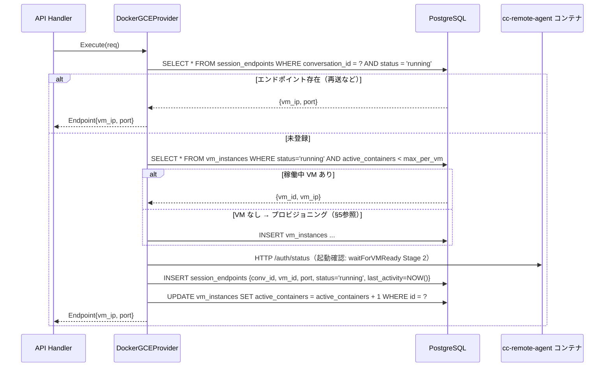

# Docker on GCE 方式 詳細設計書

## 1. 概要とアーキテクチャ全体像

### 背景

現行の cc-tunnel は、単一の cc-remote-agent インスタンスに全会話セッションをルーティングしている。
これによりセッション間でファイルシステム・プロセス空間が共有され、リソース競合・セキュリティ上の懸念がある。

本設計書は `design/session-isolation.md` の比較分析（案1推奨）を踏まえ、
**GCE VM 上の Docker コンテナを会話セッション単位で管理する**方式の詳細アーキテクチャを定義する。

### Provider パターン（現在の実装状態）

cc-tunnel はセッション実行バックエンドを `ExecutionProvider` インターフェース（`internal/provider/provider.go`）として抽象化している。

```go
// internal/provider/provider.go
type ExecutionProvider interface {
    Execute(ctx context.Context, req remoteclient.Request, onEvent func(remoteclient.StreamEvent)) (string, error)
}
```

現在の Provider 一覧:

| Provider | パッケージ | 状態 | 説明 |
|----------|-----------|------|------|
| `local` | `internal/provider/local/` | **実装済み** | ローカル Docker DooD + SessionManager |
| `docker_gce` | `internal/provider/dockergce/` | **本格実装済み** | GCE VM 上 Docker（TCP 接続方式） |
| `cloud_run_sandbox` | `internal/provider/cloudrunsandbox/` | モック実装 | Cloud Run Sandbox（実装予定） |

`EXECUTION_PROVIDER` 環境変数で切り替える（`main.go` の `newProviderFromEnv()` が担当）。

> **注意**: `docker_gce` Provider は本格実装済み。本書はその設計仕様および実装詳細を記録する。

### local provider の実装（参考: DooD 方式）

`local` provider は同一ホスト上の Docker Daemon（DooD: Docker-outside-of-Docker）を使い、会話セッションごとにコンテナを作成する。

```
LocalDockerProvider
  └── SessionManager（internal/docker/session_manager.go）
        ├── GetOrCreate(convID) → *remoteclient.Client  // コンテナ取得/作成
        ├── Stop(convID)                                // 明示的停止
        ├── StopAll()                                   // グレースフルシャットダウン
        └── CleanupOrphans()                            // 起動時孤児コンテナ削除
```

- セッション状態はインメモリ（`map[string]*session`）で管理
- アイドルタイムアウト（デフォルト15分）を `time.AfterFunc` で実装
- compose.yaml で `/var/run/docker.sock` をマウントして DooD を実現

`docker_gce` provider は `local` の `SessionManager` の代わりに **GCE VM ライフサイクル管理**を担う。

### Before / After

**Before（旧実装）**:

```
Browser → frontend (nginx) → cc-tunnel (Cloud Run)
                                  ↓ HTTP (固定 URL: -agent-url フラグ)
                             cc-remote-agent (単一インスタンス)
                                  ↓ exec
                             claude CLI (全セッション共有)
```

**現在（local provider 実装済み）**:

```
Browser → frontend (nginx) → cc-tunnel (Cloud Run)
                                  └── LocalDockerProvider
                                           └── SessionManager
                                                    ↓ Docker Socket (DooD)
                                                container-{conv_abc} cc-remote-agent:9091  ← /auth/* + Execute
                                                container-{conv_def} cc-remote-agent:9092  ← /auth/* + Execute
                                                         ↓ exec
                                                    claude CLI (セッション独立)
```

**計画（docker_gce provider: 本設計書の対象）**:

```
Browser → frontend (nginx) → cc-tunnel (Cloud Run)
                                  ├── 認証専用 cc-remote-agent (設計方針は §2.4 参照)
                                  │
                                  └── DockerGCEProvider
                                           └── GCE VM ライフサイクル管理
                                                    ↓ VPC Connector → Internal IP
                                                GCE VM (Docker Host)
                                                    ├── container-{conv_abc} cc-remote-agent:9091
                                                    ├── container-{conv_def} cc-remote-agent:9092
                                                    └── container-{conv_...} cc-remote-agent:909N
                                                             ↓ exec
                                                        claude CLI (セッション独立)
```

### アーキテクチャ全体図（docker_gce C4 Level 2）

```
┌────────────────────────────────────────────────────────────────────┐
│  Browser                                                           │
│  React SPA (Vite + Tailwind CSS + xterm.js)                       │
└────────────────────────────┬───────────────────────────────────────┘
                             │ HTTP (port 443)
                             ▼
┌────────────────────────────────────────────────────────────────────┐
│  frontend (nginx)                                                  │
│  静的ファイル配信 + /api/* → cc-tunnel プロキシ                    │
└────────────────────────────┬───────────────────────────────────────┘
                             │ HTTP (port 8080)
                             ▼
┌────────────────────────────────────────────────────────────────────┐
│  cc-tunnel (Go, Cloud Run)                                         │
│                                                                    │
│  ┌──────────────┐  ┌─────────────────────────────────────────┐    │
│  │ API Handler  │  │ DockerGCEProvider（実装済み）            │    │
│  │ (handler.go) │  │  - ExecutionProvider interface 実装      │    │
│  │              ├─▶│  - GCE VM ライフサイクル管理             │    │
│  │ Auth Handler │  │  - IdleChecker / VMScaler               │    │
│  │ (認証専用)  ─┼─▶│                                         │    │
│  └──────────────┘  └───────────┬─────────────────────────────┘    │
│                                │                                   │
└────────────────────────────────┼───────────────────────────────────┘
          │                      │ Serverless VPC Access Connector
          │                      │ (10.8.0.0/28 → VPC)
          ▼                      ▼
   ┌─────────────┐    ┌──────────────────────┐
   │ Cloud SQL   │    │ GCE VM (Docker Host) │
   │ PostgreSQL  │    │  Internal IP         │
   │  pgx/v5    │    │
   └─────────────┘    │ ┌──────────────────┐ │
                      │ │ container-{abc}  │ │
                      │ │ cc-remote-agent  │ │
                      │ │ :9091           │ │
                      │ └──────────────────┘ │
                      │ ┌──────────────────┐ │
                      │ │ container-{def}  │ │
                      │ │ cc-remote-agent  │ │
                      │ │ :9092           │ │
                      │ └──────────────────┘ │
                      └──────────────────────┘
```

---

## 2. コンポーネント詳細

### 2.1 DockerGCEProvider

`apps/cc-tunnel/internal/provider/dockergce/` パッケージに実装済み。
本節はその設計仕様および実装詳細を記録する。

#### local provider との対比

| 項目 | local provider | docker_gce provider |
|------|---------------|---------------------|
| セッション管理 | `docker/SessionManager`（インメモリ） | GCE VM ライフサイクル管理（DB永続化） |
| コンテナ起動 | local Docker daemon（DooD） | GCE VM startup-script で cc-remote-agent 起動、HTTP (TCP) で直接接続 |
| スケール | ホスト1台のみ | 複数 GCE VM を動的プロビジョニング |
| 状態永続化 | インメモリ（再起動で消失） | PostgreSQL（Cloud Run 再起動に耐性） |
| アイドル管理 | `time.AfterFunc`（インメモリ） | IdleChecker goroutine + DB |

#### 責務

1. 会話ID（`conversation_id`）→ cc-remote-agent エンドポイント（VM IP + port）のマッピング管理
2. GCE VM のプロビジョニング / デプロビジョニング（Compute Engine API 呼び出し）
3. GCE VM 上の cc-remote-agent コンテナ管理（startup-script 方式で起動、TCP HTTP で接続）
4. アイドル検出（15分タイムアウト）と自動クリーンアップ
5. VM スケールダウン（全コンテナ削除後 5分でVM削除）
6. エンドポイント情報の PostgreSQL 永続化

#### パッケージ構成

```
apps/cc-tunnel/internal/
├── gce/                   # GCE クライアント層（Phase 1a 実装済み）
│   ├── client.go          # GCEClient インターフェース定義
│   ├── mock_client.go     # テスト用 MockGCEClient
│   └── sdk_client.go      # cloud.google.com/go/compute/apiv1 実装
└── provider/dockergce/
    ├── mock.go            # MockProvider（フォールバック用スタブ）
    ├── provider.go        # DockerGCEProvider 本体（実装済み）
    │                      #   Execute / getOrCreateEndpoint / waitForVMReady(2段階) / Close
    ├── idle_checker.go    # IdleChecker goroutine（IdleCheckInterval 間隔でコンテナ idle 検出）（実装済み: Phase 3）
    └── vmscaler.go        # VMScaler goroutine（アイドル VM を 5分後に削除）（実装済み: Phase 3）
```

#### インターフェース定義

```go
// ExecutionProvider を実装
type DockerGCEProvider struct {
    config      Config
    repo        gceRepository
    idleChecker *IdleChecker
    vmScaler    *VMScaler
}

func (p *DockerGCEProvider) Execute(ctx context.Context, req remoteclient.Request, onEvent func(remoteclient.StreamEvent)) (string, error) {
    endpoint, err := p.getOrCreateEndpoint(ctx, req.ConversationID)
    if err != nil {
        return "", fmt.Errorf("get session endpoint: %w", err)
    }
    sessionClient := remoteclient.NewClient(
        fmt.Sprintf("http://%s:%d", endpoint.VMIP, endpoint.Port),
    )
    return sessionClient.Execute(ctx, req, onEvent)
}
```

#### 主要メソッド

```go
// getOrCreateEndpoint: 会話IDに対応するエンドポイントを返す。
// 未登録の場合はVM確保 → コンテナ作成 → DB登録を行う。
func (p *DockerGCEProvider) getOrCreateEndpoint(ctx context.Context, conversationID string) (Endpoint, error)
```

### 2.2 GCE VM（Docker Host）

| 項目 | 設定値 | 根拠 |
|------|--------|------|
| マシンタイプ | `e2-standard-2` (2 vCPU, 8GB RAM) | claude CLI 1プロセス ≈ 200-500MB。10並行セッションに対応可 |
| OS イメージ | カスタムイメージ `cc-agent-base-v{N}` | cc-remote-agent イメージプリプル済みで起動を高速化 |
| ディスク | 50GB SSD、`autoDelete: true` | VM削除時にディスクも自動削除 |
| 外部IP | なし（Internal IP のみ） | セキュリティ: 外部からの直接アクセスを遮断 |
| ネットワークタグ | `cc-tunnel-agent` | ファイアウォールルールのターゲット指定に使用 |

**startup-script**（VM 起動時に実行）:

```bash
#!/bin/bash
# COS では Docker がプリインストール済み
# Docker daemon に TCP アクセスを追加してマルチコンテナ管理を可能にする
# WARNING: TCP 2375 は暗号化なし。VPC 内 + ファイアウォールで保護すること。
mkdir -p /etc/docker
echo '{"hosts":["tcp://0.0.0.0:2375","unix:///var/run/docker.sock"]}' > /etc/docker/daemon.json
systemctl restart docker 2>/dev/null || true
sleep 5
# cc-remote-agent イメージを事前取得（コンテナ起動の高速化）
docker pull REGION-docker.pkg.dev/PROJECT/cc-tunnel/cc-remote-agent:latest || true
```

> **注意**: startup-script ではコンテナを起動しない。Docker daemon の TCP リスナーを有効化するのみ。
> コンテナ起動は cc-tunnel の `DockerGCEProvider` が `dockerhost.Client` 経由で動的に行う。

### 2.3 Docker コンテナ（cc-remote-agent）

GCE VM 起動時の startup-script で cc-remote-agent コンテナを起動する（SSH 不要; Docker over TCP 方式）。

| 項目 | 設定値 |
|------|--------|
| イメージ | `REGION-docker.pkg.dev/PROJECT/cc-tunnel/cc-remote-agent:latest` |
| コンテナ名 | `session-{conversation_id}` |
| リソース制限 | `--memory=512m --cpus=0.5` |
| ネットワーク | `--network=bridge`（コンテナ間通信なし、外部通信は Anthropic API のみ） |
| 環境変数 | `ANTHROPIC_API_KEY`（Secret Manager から取得） |
| ポート | `-p {dynamic_port}:9091`（ホスト側ポートは 9091-9200 の範囲で動的割り当て） |

### 2.4 認証フローの設計方針

#### local provider における認証（実装済み）

`/auth/*` エンドポイントはすべて `conversationId` で特定したセッションコンテナにルーティングされる（per-session container 方式）。
`cc-remote-agent-auth` 共有常駐コンテナは `cmd_cctunnel_cc_remote_agent_auth_retire` にて廃止済み。

`prepare.compose.yaml` は cc-remote-agent イメージのビルド専用（`docker build` で `cc-remote-agent:latest` を生成）。

#### docker_gce における認証設計

docker_gce を使用する Cloud Run 環境でも、認証は per-session container 内で行う。
`/auth/*` エンドポイントは `conversationId` でセッションコンテナを特定してルーティングするため、
認証専用の独立サービスは不要となった。

---

## 3. 通信経路

### 3.1 全体通信経路

```
cc-tunnel (Cloud Run)
  │
  │  Serverless VPC Access Connector（10.8.0.0/28 → VPC: 10.128.0.0/20）
  │
  ├── Cloud SQL (Private IP: 10.128.x.x)
  │     pgx/v5 で PostgreSQL 接続（port 5432）
  │
  └── GCE VM (Internal IP: 10.128.0.x)
        │
        └── HTTP (port 9091) → cc-remote-agent コンテナ（startup-script で起動済み）
```

### 3.2 Cloud Run → GCE 内部通信（VPC Connector）

- **Serverless VPC Access Connector**: Cloud Run がプライベート VPC リソースにアクセスするためのサーバーレスコネクタ
- コネクタのサブネット（例: `10.8.0.0/28`）から GCE VM の Internal IP へルーティング
- GCE VM はパブリック IP を持たないため、コネクタ経由のみアクセス可能

### 3.3 Docker API アクセス方式（Docker daemon TCP + cc-remote-agent HTTP）

cc-tunnel の DockerGCEProvider は2種類の TCP 接続を使用する。

| 接続 | エンドポイント | 用途 |
|------|--------------|------|
| Docker daemon API | `tcp://{vm_ip}:2375` | コンテナ管理（起動・停止・削除） |
| cc-remote-agent HTTP | `http://{vm_ip}:{dynamic_port}` | Claude CLI 実行・認証 |

**採用理由（Docker over TCP を選択）**:
- COS (Container-Optimized OS) イメージに SSH バイナリが含まれない（distroless 相当）
- SSH トンネル方式は実現困難なため TCP 方式を採用
- Docker daemon TCP API 経由でコンテナを動的に管理することで、1 VM 上で複数コンテナのプール管理が可能

**セキュリティ**:
- TCP 2375 は暗号化なし。VPC Connector サブネットからのみ到達可能にすること。
- ファイアウォールルールでタグ `cc-tunnel-agent` への TCP 2375 を VPC Connector サブネット（例: `10.8.0.0/28`）から限定許可すること。
- 本番有効化前にファイアウォールルール `allow-cc-tunnel-docker-api` の設定が必須。

**実装**: `apps/cc-tunnel/internal/dockerhost/` パッケージの `ContainerManager` インターフェース経由。

```go
// dockerhost.ContainerManager
type ContainerManager interface {
    RunAgentContainer(ctx, image, name string, hostPort, containerPort int) error
    StopContainer(ctx, name string) error
    RemoveContainer(ctx, name string) error
    IsReady(ctx) bool  // Docker daemon TCP の疎通確認
}
```

`waitForVMReady` Stage 2 では `IsReady()` で Docker daemon の TCP 到達を確認してから `getOrCreateEndpoint` に戻る。

### 3.4 cc-tunnel → cc-remote-agent コンテナ（HTTP）

- **プロトコル**: HTTP（コンテナ内 port 9091 を VM ホスト側の動的ポートにマッピング）
- **ベースURL**: `http://{vm_internal_ip}:{dynamic_port}`
- **再利用**: `remoteclient.Client` は per-session で `NewClient(baseURL)` して生成（既存コード変更なし）

**動的ポート割り当て戦略**:
- 使用可能レンジ: 9091〜9200（最大110セッション/VM）
- DB の `session_endpoints.port` で使用中ポートを管理
- `SELECT MAX(port) + 1 FROM session_endpoints WHERE vm_instance_id = ? AND status = 'running'` で次のポートを決定

---

## 4. コンテナライフサイクル管理

### 4.1 コンテナ生成（セッション開始時）

`Execute()` → `getOrCreateEndpoint(conv_id)` が呼ばれるフローは以下の通り。



### 4.2 per-session ルーティング（Handler 側）

`handler.go` の `SendMessage()` は `ExecutionProvider.Execute()` を呼ぶ（既存コードのまま）。
docker_gce の `Execute()` 内部で動的エンドポイントを解決し `remoteclient.Client` を生成する。

```go
// handler.go（変更なし）
newSessionID, err := h.executionProvider.Execute(execCtx, executeReq, func(event remoteclient.StreamEvent) {
    // イベント処理...
})

// DockerGCEProvider.Execute()（実装済み）
func (p *DockerGCEProvider) Execute(ctx context.Context, req remoteclient.Request, onEvent func(remoteclient.StreamEvent)) (string, error) {
    endpoint, err := p.getOrCreateEndpoint(ctx, req.ConversationID)
    if err != nil {
        return "", fmt.Errorf("get session endpoint: %w", err)
    }
    sessionClient := remoteclient.NewClient(
        fmt.Sprintf("http://%s:%d", endpoint.VMIP, endpoint.Port),
    )
    return sessionClient.Execute(ctx, req, onEvent)
}
```

### 4.3 last_activity の更新タイミング

| イベント | 更新箇所 |
|---------|---------|
| `POST /api/conversations/{id}/messages` 受信時 | `getOrCreateEndpoint()` 内でコンテナ作成 or 取得と同時に更新 |
| `Execute()` goroutine 完了時 | DB の `last_activity` を更新 |
| `GET /api/conversations/{id}` で `status='running'` の場合 | `GetConversation` handler 内で更新（定常ポーリングへの対応） |

### 4.4 アイドル検出（IdleChecker）

IdleChecker goroutine は 60秒間隔で稼働し、非アクティブなコンテナを削除する。

```go
// idlechecker.go の概略
func (ic *IdleChecker) Run(ctx context.Context) {
    ticker := time.NewTicker(60 * time.Second)
    defer ticker.Stop()
    for {
        select {
        case <-ctx.Done():
            return
        case <-ticker.C:
            ic.checkAndCleanup(ctx)
        }
    }
}

func (ic *IdleChecker) checkAndCleanup(ctx context.Context) {
    // last_activity が 15分以上前のセッションを取得
    endpoints, _ := ic.repo.ListIdleSessionEndpoints(ctx, 15*time.Minute)
    for _, ep := range endpoints {
        // Docker コンテナ削除
        ic.provisioner.StopContainer(ctx, ep.VMIP, ep.ContainerName)
        ic.provisioner.RemoveContainer(ctx, ep.VMIP, ep.ContainerName)
        // DB 更新
        ic.repo.UpdateSessionEndpointStatus(ctx, ep.ID, "terminated")
        ic.repo.DecrementVMActiveContainers(ctx, ep.VMInstanceID)
    }
}
```

### 4.5 コンテナ削除コマンド

```bash
# IdleChecker が実行するコンテナ削除（GCE API 経由 VM 削除）
docker stop session-{conversation_id}
docker rm session-{conversation_id}
```

---

## 5. GCEインスタンスライフサイクル

### 5.1 VM 生成（最初のコンテナ要求時）

稼働中の VM が存在しない（またはキャパシティ不足の）場合、DockerGCEProvider が Compute Engine API を呼び出して VM を起動する。

**Compute Engine API リクエスト**:

```json
POST https://compute.googleapis.com/compute/v1/projects/{PROJECT}/zones/{ZONE}/instances
{
  "name": "cc-agent-vm-{random_suffix}",
  "machineType": "zones/{ZONE}/machineTypes/e2-standard-2",
  "disks": [{
    "boot": true,
    "autoDelete": true,
    "initializeParams": {
      "sourceImage": "projects/{PROJECT}/global/images/cc-agent-base-v{N}"
    }
  }],
  "networkInterfaces": [{
    "subnetwork": "projects/{PROJECT}/regions/{REGION}/subnetworks/{SUBNET}",
    "accessConfigs": []
  }],
  "metadata": {
    "items": [{
      "key": "startup-script",
      "value": "#!/bin/bash\nsystemctl start docker\ndocker pull REGION-docker.pkg.dev/{PROJECT}/cc-tunnel/cc-remote-agent:latest"
    }]
  },
  "tags": { "items": ["cc-tunnel-agent"] },
  "labels": { "purpose": "cc-tunnel-session", "managed-by": "cc-tunnel" }
}
```

**VM 起動待機**:
- Compute Engine API のオペレーション完了をポーリング（最大90秒、3秒間隔）
- `status == "RUNNING"` かつ `networkInterfaces[0].networkIP` が設定されたことを確認
- タイムアウト時はエラーを返し、VM の削除クリーンアップを実行

### 5.2 VMScaler（全コンテナ削除後の VM 削除）

```
コンテナ削除イベント
  ↓
DecrementVMActiveContainers(vm_instance_id)
  ↓
active_containers == 0 → UPDATE vm_instances SET idle_since = NOW()
  ↓
VMScaler（5分間隔チェック）
  ├── SELECT * FROM vm_instances WHERE status='running'
  │     AND active_containers = 0
  │     AND idle_since < NOW() - INTERVAL '5 minutes'
  ↓
  GCE API: instances.delete({vm_name})
  ↓
  UPDATE vm_instances SET status = 'terminated'
```

**VMScaler goroutine**（`vmscaler.go`）:

```go
func (vs *VMScaler) Run(ctx context.Context) {
    ticker := time.NewTicker(5 * time.Minute)
    defer ticker.Stop()
    for {
        select {
        case <-ctx.Done():
            return
        case <-ticker.C:
            vs.scaleDown(ctx)
        }
    }
}
```

### 5.3 VM 最大収容セッション数

| マシンタイプ | RAM | 推定最大セッション数 | ポートレンジ |
|------------|-----|---------------------|------------|
| e2-standard-2 | 8GB | 10〜16 | 9091-9200 |

- claude CLI 1プロセス ≈ 200-500MB 使用
- 安全マージン込みで **1VM あたり最大10セッション**を推奨値とする
- `max_containers_per_vm = 10`（`Config` で設定可能）
- 上限到達時は新 VM を自動プロビジョニング

### 5.4 Warm Pool 戦略

コールドスタート（VM 起動 30-60秒）を回避するために、最低1台の VM を常時待機させる設定。

| 設定 | 値 | コスト | 説明 |
|------|-----|--------|------|
| `warm_pool_size=0` | デフォルト | $0（アイドル時） | 完全コスト最適化。VM 未稼働時は初回のみ待ち。 |
| `warm_pool_size=1` | 推奨 | ~$5.76/月（e2-micro） | 1台常時待機。初回レイテンシ解消。 |

Warm pool VM は `e2-micro` で十分（コンテナゼロの待機状態のみ）。
セッション要求時に `e2-standard-2` を別途起動するか、warm pool VM を `e2-standard-2` にアップグレードするかは設定で切り替え可能。

---

## 6. セッション間の隔離とセキュリティ

### 6.1 Docker による隔離

| 隔離レベル | 実装方法 |
|-----------|---------|
| プロセス隔離 | Linux PID namespace（コンテナ独立） |
| ファイルシステム隔離 | コンテナごとに独立した書き込み層。`/home/user/.claude` は ephemeral（コンテナ削除で消去） |
| ネットワーク隔離 | Docker bridge network（コンテナ間の直接通信なし） |
| リソース隔離 | `--memory=512m --cpus=0.5`（一セッションが全リソースを占有することを防止） |

### 6.2 VPC ファイアウォールルール

| ルール | ソース | ターゲット | ポート | 用途 |
|--------|--------|-----------|--------|------|
| `allow-cc-tunnel-to-agent` | VPC Connector サブネット（10.8.0.0/28） | タグ `cc-tunnel-agent` | tcp:9091-9200 | cc-tunnel → GCE VM cc-remote-agent 通信（動的ポート範囲） |
| `allow-cc-tunnel-docker-api` | VPC Connector サブネット（10.8.0.0/28） | タグ `cc-tunnel-agent` | tcp:2375 | cc-tunnel → GCE VM Docker daemon TCP API（コンテナ管理） |
| `deny-all-ingress` | 0.0.0.0/0 | タグ `cc-tunnel-agent` | all | 外部からのアクセス遮断 |
| `allow-egress-anthropic` | タグ `cc-tunnel-agent` | 0.0.0.0/0 | tcp:443 | claude CLI → Anthropic API |

> **⚠ TCP 2375 セキュリティ注意**: Docker daemon TCP は暗号化なし。`allow-cc-tunnel-docker-api` ルールは VPC Connector サブネットからのみ許可すること（0.0.0.0/0 に開けてはならない）。

### 6.3 Secret Manager による API キー管理

環境変数 `ANTHROPIC_API_KEY` は Secret Manager から取得し、コンテナ起動時に注入する。

```go
// provisioner.go: コンテナ起動前に Secret Manager から API キーを取得
apiKey, err := p.secretClient.AccessSecretVersion(ctx,
    "projects/PROJECT/secrets/anthropic-api-key/versions/latest")

// docker run の環境変数として渡す
config := &container.Config{
    Env: []string{fmt.Sprintf("ANTHROPIC_API_KEY=%s", apiKey)},
}
```

GCE VM のメタデータには API キーを格納しない。VM が侵害された場合でも Secret Manager の IAM 権限がなければキーは取得できない。

### 6.4 コンテナイメージの完全性保証

- **Artifact Registry**: `REGION-docker.pkg.dev/{PROJECT}/cc-tunnel/cc-remote-agent:latest` のみ許可
- **Binary Authorization**: 署名済みイメージのみ GCE VM が pull できるよう設定（将来拡張）
- **Pull ポリシー**: startup-script で `docker pull` を実行し、最新イメージを常に使用

### 6.5 SSH 不使用（Docker over TCP 方式）

Docker over TCP 方式（非 SSH）を採用したため、SSH 鍵管理は不要:

- cc-remote-agent コンテナは GCE VM の startup-script で直接 `docker run` 起動
- cc-tunnel は `http://{vm_internal_ip}:{AgentPort}` で HTTP 直接接続（SSH トンネル不要）
- GCE VM には SSH バイナリを含まない COS (Container-Optimized OS) を使用
- cc-tunnel の Service Account には Compute Engine API（インスタンス作成・削除）の権限のみ付与

---

## 7. DBスキーマ追加

`local` provider のセッション管理はインメモリで完結するため DB スキーマ変更は不要。
`docker_gce` provider では Cloud Run 再起動に耐える永続化が必要なため、以下の2テーブルを追加する。

既存の `conversations` テーブル・`messages` テーブルはそのまま維持する。

### 7.1 session_endpoints テーブル

会話セッションとコンテナエンドポイントの対応を管理する。

```sql
-- +goose Up
CREATE TABLE session_endpoints (
    id              UUID        PRIMARY KEY DEFAULT gen_random_uuid(),
    conversation_id UUID        NOT NULL REFERENCES conversations(id) ON DELETE CASCADE,
    vm_instance_id  UUID        NOT NULL REFERENCES vm_instances(id),
    container_name  TEXT        NOT NULL,
    port            INTEGER     NOT NULL,
    status          TEXT        NOT NULL DEFAULT 'provisioning'
                    CHECK (status IN ('provisioning', 'running', 'terminated')),
    last_activity   TIMESTAMPTZ NOT NULL DEFAULT NOW(),
    created_at      TIMESTAMPTZ NOT NULL DEFAULT NOW(),
    UNIQUE (conversation_id)
);

CREATE INDEX idx_session_endpoints_last_activity
    ON session_endpoints(last_activity)
    WHERE status = 'running';

CREATE INDEX idx_session_endpoints_vm
    ON session_endpoints(vm_instance_id)
    WHERE status = 'running';

-- +goose Down
DROP TABLE session_endpoints;
```

**カラム説明**:

| カラム | 型 | 説明 |
|--------|-----|------|
| `id` | UUID | エンドポイントの一意識別子 |
| `conversation_id` | UUID | 対応する会話ID（UNIQUE: 1会話に1エンドポイント） |
| `vm_instance_id` | UUID | コンテナが動作するVM |
| `container_name` | TEXT | `session-{conversation_id}` 形式 |
| `port` | INTEGER | VM ホスト側のポート番号（9091-9200） |
| `status` | TEXT | `provisioning` → `running` → `terminated` |
| `last_activity` | TIMESTAMPTZ | アイドル検出の基準時刻。メッセージ送受信時に更新 |

### 7.2 vm_instances テーブル

GCE VM インスタンスのライフサイクルを管理する。

```sql
-- +goose Up
CREATE TABLE vm_instances (
    id                  UUID        PRIMARY KEY DEFAULT gen_random_uuid(),
    gce_instance_name   TEXT        NOT NULL UNIQUE,
    zone                TEXT        NOT NULL,
    internal_ip         TEXT        NOT NULL,
    status              TEXT        NOT NULL DEFAULT 'provisioning'
                        CHECK (status IN ('provisioning', 'running', 'terminated')),
    active_containers   INTEGER     NOT NULL DEFAULT 0,
    idle_since          TIMESTAMPTZ,
    created_at          TIMESTAMPTZ NOT NULL DEFAULT NOW()
);

CREATE INDEX idx_vm_instances_status
    ON vm_instances(status)
    WHERE status = 'running';

-- +goose Down
DROP TABLE vm_instances;
```

**カラム説明**:

| カラム | 型 | 説明 |
|--------|-----|------|
| `id` | UUID | VM の一意識別子 |
| `gce_instance_name` | TEXT | GCE インスタンス名（例: `cc-agent-vm-a1b2c3`） |
| `zone` | TEXT | GCE ゾーン（例: `asia-northeast1-b`） |
| `internal_ip` | TEXT | VPC 内部 IP（例: `10.128.0.5`） |
| `status` | TEXT | `provisioning` → `running` → `terminated` |
| `active_containers` | INTEGER | 稼働中コンテナ数。0になると `idle_since` を設定 |
| `idle_since` | TIMESTAMPTZ | 全コンテナ削除後の経過時間計測用。VMScaler が参照 |

### 7.3 既存スキーマとの整合性

- `session_endpoints.conversation_id` → `conversations.id` の外部キー（CASCADE DELETE）
  - 会話削除時にエンドポイントレコードも自動削除
  - コンテナ自体は IdleChecker が物理削除するため、DBレコードとの二重管理に注意
- `session_endpoints.vm_instance_id` → `vm_instances.id` の外部キー
  - VMを先に削除する場合は `session_endpoints` を先に `terminated` に更新すること

### 7.4 マイグレーションファイル配置

```
apps/cc-tunnel/internal/db/migrations/
├── 001_create_conversations.sql      # 既存
├── 002_create_messages.sql           # 既存
├── 003_add_conversation_status.sql   # 既存
├── 004_add_message_status.sql        # 既存
├── 005_create_vm_instances.sql       # 新規（vm_instances が先: FK依存順）
└── 006_create_session_endpoints.sql  # 新規
```

---

## 8. 既存コードへの変更影響範囲

### 8.1 現在の実装状態（Provider パターン導入後）

Provider パターンはすでに導入済み。`handler.go` は `ExecutionProvider` インターフェース経由で実行バックエンドを呼ぶ。

**現在の `main.go` 構造**（`cmd/cc-tunnel/main.go`）:
```go
// EXECUTION_PROVIDER 環境変数で provider を選択
execProvider, err := newProviderFromEnv(os.Getenv("EXECUTION_PROVIDER"))

// orphan cleanup（local provider のみ実装）
if cleaner, ok := execProvider.(orphanCleaner); ok {
    _ = cleaner.CleanupOrphans(ctx)
}

// graceful shutdown
if c, ok := execProvider.(io.Closer); ok {
    c.Close()
}

handler := api.NewHandler(repo, remote, execProvider)
```

**現在の `handler.go` の Server 構造体**:
```go
type Server struct {
    repo              repository
    remote            remoteClient              // 認証専用 cc-remote-agent クライアント
    executionProvider provider.ExecutionProvider // claude CLI 実行バックエンド（LocalDockerProvider 等）
    batchInterval     time.Duration
    doneCh            chan struct{}
}
```

**`SendMessage()` の呼び出し箇所**（handler.go）:
```go
// 現在の実装: ExecutionProvider 経由で実行
newSessionID, err := h.executionProvider.Execute(execCtx, executeReq, func(event remoteclient.StreamEvent) {
    // イベント処理...
})
```

### 8.2 docker_gce 実装済み変更内容

#### `apps/cc-tunnel/internal/dockerhost/`

**実装済み内容（マルチコンテナ対応で新規追加）**:
- `interface.go`: `ContainerManager` インターフェース定義
- `client.go`: Docker daemon TCP 接続クライアント（`github.com/docker/docker/client` ベース）
- `mock.go`: `MockContainerManager`（テスト用）

#### `apps/cc-tunnel/internal/provider/dockergce/`

**実装済み内容**:
- `mock.go`: `MockProvider` はそのまま維持（フォールバック用）
- `provider.go`（実装済み・マルチコンテナ対応済み）: `DockerGCEProvider` 本格実装
  - `Execute()` / `getOrCreateEndpoint()` / `waitForVMReady()`（2段階: GCE API RUNNING → Docker daemon TCP 疎通）/ `CleanupOrphans()`
  - `ContainerManagerFactory` フィールドによる Docker クライアント差し替え（テスト可能設計）
  - `buildStartupScript()`: Docker daemon TCP 有効化のみ（コンテナ起動なし）
  - ポート動的割り当て（`GetMaxPortOnVM` + DB UNIQUE 制約でレース防止）
  - 同一 VM への複数コンテナ（`MaxContainers` 設定、デフォルト 10）
  - VM active_containers 上限到達時に新 VM を自動プロビジョン（スケールアウト）
- `idle_checker.go`（実装済み）: `IdleChecker` goroutine（コンテナ idle 検出 → `dockerhost.Client` 経由で stop/remove）
- `vmscaler.go`（実装済み）: `VMScaler` goroutine（active_containers=0 の VM を削除）
- `e2e_test.go`（新規）: testcontainers-go（postgres:16-alpine）+ MockContainerManager を用いた統合 E2E テスト

**影響度**: **大**（マルチコンテナ対応・dockerhost 層追加）

#### `apps/cc-tunnel/cmd/cc-tunnel/main.go`

**実装済み内容**:
- `newProviderFromEnv()` の `docker_gce` ケースを `DockerGCEProvider` 本実装に差し替え
- GCE 設定を環境変数から読み込み

**実装後のコード**:
```go
case "docker_gce":
    cfg := dockergce.DockerGCEConfig{
        ProjectID:   os.Getenv("GCE_PROJECT_ID"),
        Zone:        getEnvOrDefault("GCE_ZONE", "us-central1-a"),
        MachineType: getEnvOrDefault("GCE_MACHINE_TYPE", "e2-medium"),
        AgentImage:  os.Getenv("GCE_AGENT_IMAGE"),
    }
    return dockergce.NewDockerGCEProvider(cfg, gceClient, repo), nil
```

**環境変数一覧**:

| 変数名 | デフォルト | 説明 |
|--------|-----------|------|
| `GCE_PROJECT_ID` | 必須 | GCP プロジェクト ID |
| `GCE_ZONE` | `us-central1-a` | GCE ゾーン |
| `GCE_MACHINE_TYPE` | `e2-medium` | VM マシンタイプ |
| `GCE_AGENT_IMAGE` | 必須 | cc-remote-agent の Artifact Registry URL |
| `GCE_MAX_CONTAINERS` | `10` | 1 VM あたりの最大コンテナ数 |

**影響度**: **小**（`newProviderFromEnv` の docker_gce ケース修正のみ）

#### `apps/cc-tunnel/internal/db/repository.go`

**変更内容**（docker_gce 実装時に追加）:
- `session_endpoints` テーブルの CRUD メソッドを追加:
  - `CreateSessionEndpoint(ctx, conversationID, vmInstanceID, containerName, port)`
  - `GetSessionEndpoint(ctx, conversationID)`
  - `UpdateSessionEndpointStatus(ctx, id, status)`
  - `ListIdleSessionEndpoints(ctx, idleThreshold time.Duration)`
  - `UpdateSessionEndpointLastActivity(ctx, conversationID)`
- `vm_instances` テーブルの CRUD メソッドを追加:
  - `CreateVMInstance(ctx, gceInstanceName, zone, internalIP)`
  - `GetAvailableVMInstance(ctx, maxContainers int)`
  - `UpdateVMInstanceStatus(ctx, id, status)`
  - `IncrementVMActiveContainers(ctx, id)`
  - `DecrementVMActiveContainers(ctx, id)`
  - `ListIdleVMInstances(ctx, idleThreshold time.Duration)`

**影響度**: **中**

### 8.3 変更不要なファイル

| ファイル | 理由 |
|---------|------|
| `apps/cc-tunnel/internal/api/handler.go` | `ExecutionProvider.Execute()` を呼ぶ形は変更なし。docker_gce は Provider 内部で解決する。 |
| `apps/cc-tunnel/internal/remoteclient/client.go` | per-session で `NewClient(url)` を呼ぶ形で再利用。コード変更なし。 |
| `apps/cc-remote-agent/` 全体 | コンテナイメージとしてそのまま使用。コード変更不要。 |
| `apps/frontend/` 全体 | 外部 API（OpenAPI）は変更なし。会話開始が若干遅くなるのみ。 |
| `apps/openapi/openapi.yaml` | 外部 API 定義に変更なし。 |
| `apps/cc-tunnel/internal/api/gen.go` | OpenAPI 定義が変わらないため再生成不要。 |

### 8.4 認証フローへの影響

| 処理 | 実装 |
|------|-----|
| `GET /api/auth/status` | per-session container にルーティング（conversationId で特定） |
| `POST /api/auth/login` | per-session container にルーティング（conversationId で特定） |
| `POST /api/conversations/{id}/messages` の実行 | `h.executionProvider.Execute()` |

---

## 9. コスト最適化

### 9.1 マシンタイプ選定

| マシンタイプ | vCPU | RAM | 単価 | 最大セッション数 | 1セッションあたりコスト |
|------------|------|-----|------|----------------|----------------------|
| e2-micro | 0.25 | 1GB | $0.008/hr | 1〜2 | $0.004〜0.008/hr |
| e2-small | 0.5 | 2GB | $0.017/hr | 2〜4 | $0.004〜0.009/hr |
| **e2-standard-2** | 2 | 8GB | $0.067/hr | 10〜16 | **$0.004〜0.007/hr** |
| e2-standard-4 | 4 | 16GB | $0.134/hr | 20〜32 | $0.004〜0.007/hr |

**e2-standard-2 を推奨する理由**:
- 10並行セッション（claude CLI × 10、各 ≈ 500MB）に対して 8GB RAM が十分
- 1セッションあたりコストが e2-small と同等以下（集約効果）
- e2-standard-4 との差が小さく、2台に分散するより1台で集約した方がコストと管理が効率的

### 9.2 アイドルコスト削減

| 状態 | コスト | 実現方法 |
|------|--------|---------|
| セッション稼働中 | $0.067/hr (1VM/10session) | 通常運用 |
| 全セッション終了 → 5分後 | $0 | VMScaler が VM 削除 |
| Warm pool (e2-micro × 1台) | $5.76/月 | 設定で有効化 |

### 9.3 Warm Pool vs コスト最適化のトレードオフ

```
                    Warm pool OFF                 Warm pool ON (e2-micro × 1)
                   ┌──────────────────┐          ┌──────────────────────────┐
初回リクエスト時:  │ VM起動: 30-60秒  │          │ コンテナ起動: 1-3秒      │
                   │ コスト: $0       │          │ コスト: $5.76/月         │
                   └──────────────────┘          └──────────────────────────┘
2回目以降（VM稼働中）: 常に 1-3秒（同じ）
```

**推奨**: 本番運用では `warm_pool_size=1` で e2-micro を常時待機させ、初回レイテンシを解消する。
開発・ステージング環境では `warm_pool_size=0` でコスト最小化。

### 9.4 コスト試算（参考）

| 使用シナリオ | 月間コスト試算 |
|------------|--------------|
| 個人利用（1日2〜3セッション、各30分） | ~$0.10〜0.30/月（Warm pool OFF） |
| 個人利用（Warm pool ON） | ~$6/月 |
| チーム利用（10名、1日10セッション） | ~$5〜15/月（GCE のみ。API コスト別） |

---

## 10. 実装フェーズ

### Phase 1: DockerGCEProvider 基盤（1〜2週間）

**目標**: GCE VM + Docker コンテナのプロビジョニングが動作する状態

1. `dockergce/types.go`: SessionEndpoint, VMInstance, Config 型定義
2. `dockergce/provisioner.go`: GCE Compute Engine API による VM 作成 / 削除
3. `dockergce/provisioner.go`: SSH 経由 Docker API によるコンテナ管理
4. DB マイグレーション作成（`005_create_vm_instances.sql`, `006_create_session_endpoints.sql`）
5. `db.Repository` に `vm_instances` / `session_endpoints` CRUD メソッドを追加

**完了基準**: ローカル（または GCE）で VM を起動し、Docker コンテナを作成・削除できること

### Phase 2: Provider 本実装（1週間）

**目標**: `EXECUTION_PROVIDER=docker_gce` でエンドツーエンドが動作する状態

1. `dockergce/provider.go`: `DockerGCEProvider.Execute()` 実装（`getOrCreateEndpoint` + `sessionClient`）
2. IdleChecker / VMScaler goroutine の実装
3. `main.go` の `docker_gce` ケースを本実装に差し替え
4. `DockerGCEProvider` が `io.Closer` を実装（グレースフルシャットダウン）

**完了基準**: エンドツーエンドで「会話開始 → VM/コンテナ起動 → Execute → レスポンス」が動作すること

### Phase 3: 認証・セキュリティ（1週間）

**目標**: 本番グレードのセキュリティが整った状態

1. Secret Manager 統合（`ANTHROPIC_API_KEY` の安全な注入）
2. OS Login / SSH 鍵管理の整備
3. VPC ファイアウォールルールの設定
4. Serverless VPC Access Connector の構成
5. 認証専用エージェントの Cloud Run サービス化（§2.4 参照）

**完了基準**: セキュリティレビューを通過し、本番 VPC 構成で動作確認できること

### Phase 4: 運用（1週間）

**目標**: 本番運用に耐える監視・回復性が整った状態

1. Warm pool 実装（`warm_pool_size` 設定、e2-micro 常時待機）
2. Cloud Monitoring ダッシュボード（VM 数、コンテナ数、エラー率、レイテンシ）
3. アラート設定（VM 数上限超過、コンテナ起動失敗率）
4. VM 起動タイムアウト・リトライロジックの実装（exponential backoff）
5. 起動時の `status='provisioning'` VM クリーンアップ（サーバー再起動後の孤児VM対処）

**完了基準**: 本番環境で1週間の連続稼働を達成し、アラートが適切に発火すること
