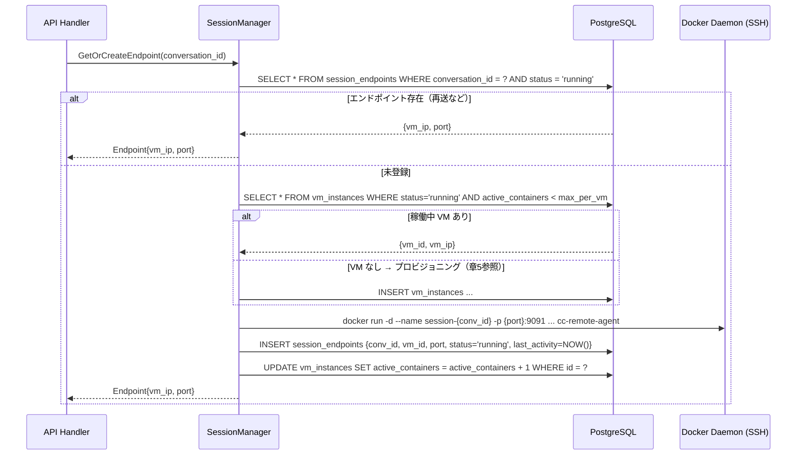

# Docker on GCE 方式 詳細設計書

## 1. 概要とアーキテクチャ全体像

### 背景

現行の cc-tunnel は、単一の cc-remote-agent インスタンスに全会話セッションをルーティングしている。
これによりセッション間でファイルシステム・プロセス空間が共有され、リソース競合・セキュリティ上の懸念がある。

本設計書は `design/session-isolation.md` の比較分析（案1推奨）を踏まえ、
**GCE VM 上の Docker コンテナを会話セッション単位で管理する**方式の詳細アーキテクチャを定義する。

### Before / After

**Before（現行）**:

```
Browser → frontend (nginx) → cc-tunnel (Cloud Run)
                                  ↓ HTTP (固定 URL: -agent-url フラグ)
                             cc-remote-agent (単一インスタンス)
                                  ↓ exec
                             claude CLI (全セッション共有)
```

**After（Docker on GCE）**:

```
Browser → frontend (nginx) → cc-tunnel (Cloud Run)
                                  ├── 認証専用 cc-remote-agent (固定1台)
                                  │
                                  └── SessionManager
                                           ↓ VPC Connector → Internal IP
                                       GCE VM (Docker Host)
                                           ├── container-{conv_abc} cc-remote-agent:9091
                                           ├── container-{conv_def} cc-remote-agent:9092
                                           └── container-{conv_...} cc-remote-agent:909N
                                                    ↓ exec
                                               claude CLI (セッション独立)
```

### アーキテクチャ全体図（C4 Level 2）

```
┌────────────────────────────────────────────────────────────────────┐
│  Browser                                                           │
│  React SPA (Vite + Tailwind CSS + xterm.js)                       │
└────────────────────────────┬───────────────────────────────────────┘
                             │ HTTP (port 443)
                             ▼
┌────────────────────────────────────────────────────────────────────┐
│  frontend (nginx)                                                  │
│  静的ファイル配信 + /api/* → cc-tunnel プロキシ                    │
└────────────────────────────┬───────────────────────────────────────┘
                             │ HTTP (port 8080)
                             ▼
┌────────────────────────────────────────────────────────────────────┐
│  cc-tunnel (Go, Cloud Run)                                         │
│                                                                    │
│  ┌──────────────┐  ┌─────────────────────────────────────────┐    │
│  │ API Handler  │  │ SessionManager (新規)                   │    │
│  │ (handler.go) │  │  - GetOrCreateEndpoint(conv_id)         │    │
│  │              ├─▶│  - IdleChecker (60秒間隔)               │    │
│  │ Auth Handler │  │  - VMScaler (5分間隔)                   │    │
│  │ (固定agent) ─┼─▶│                                         │    │
│  └──────────────┘  └───────────┬─────────────────────────────┘    │
│                                │                                   │
└────────────────────────────────┼───────────────────────────────────┘
          │                      │ Serverless VPC Access Connector
          │                      │ (10.8.0.0/28 → VPC)
          ▼                      ├──────────────────────────────────┐
   ┌─────────────┐               │                                  │
   │ Cloud SQL   │               ▼                                  ▼
   │ PostgreSQL  │    ┌──────────────────────┐        ┌────────────────────┐
   │  pgx/v5    │    │ GCE VM (Docker Host) │        │ 認証専用            │
   └─────────────┘    │  Internal IP         │        │ cc-remote-agent    │
                      │                      │        │ (固定コンテナ)     │
                      │ ┌──────────────────┐ │        └────────────────────┘
                      │ │ container-{abc}  │ │
                      │ │ cc-remote-agent  │ │
                      │ │ :9091           │ │
                      │ └──────────────────┘ │
                      │ ┌──────────────────┐ │
                      │ │ container-{def}  │ │
                      │ │ cc-remote-agent  │ │
                      │ │ :9092           │ │
                      │ └──────────────────┘ │
                      └──────────────────────┘
```

---

## 2. コンポーネント詳細

### 2.1 SessionManager（新規コンポーネント）

`apps/cc-tunnel/internal/sessionmanager/` に新規パッケージとして追加する。

#### 責務

1. 会話ID（`conversation_id`）→ cc-remote-agent エンドポイント（VM IP + port）のマッピング管理
2. GCE VM のプロビジョニング / デプロビジョニング（Compute Engine API 呼び出し）
3. GCE VM 上の Docker コンテナ作成 / 削除（SSH 経由 Docker API）
4. アイドル検出（15分タイムアウト）と自動クリーンアップ
5. VM スケールダウン（全コンテナ削除後 5分でVM削除）
6. エンドポイント情報の PostgreSQL 永続化

#### パッケージ構成

```
apps/cc-tunnel/internal/sessionmanager/
├── manager.go        # SessionManager 本体。GetOrCreateEndpoint(), ReleaseEndpoint()
├── provisioner.go    # GCE VM + Docker コンテナのプロビジョニング操作
├── idlechecker.go    # IdleChecker goroutine（60秒間隔でコンテナ idle 検出）
├── vmscaler.go       # VMScaler goroutine（5分間隔で空き VM 削除）
└── types.go          # SessionEndpoint, VMInstance, Config 型定義
```

#### インターフェース定義（`interfaces.go` に追加）

```go
// api/interfaces.go に追加
type sessionManager interface {
    GetOrCreateEndpoint(ctx context.Context, conversationID string) (Endpoint, error)
    UpdateLastActivity(ctx context.Context, conversationID string) error
}

type Endpoint struct {
    VMIP string
    Port int
}
```

#### SessionManager の主要メソッド

```go
// GetOrCreateEndpoint: 会話IDに対応するエンドポイントを返す。
// 未登録の場合はVM確保 → コンテナ作成 → DB登録を行う。
func (m *SessionManager) GetOrCreateEndpoint(ctx context.Context, conversationID string) (Endpoint, error)

// ReleaseEndpoint: 明示的なセッション終了時にコンテナを削除する（将来拡張用）。
func (m *SessionManager) ReleaseEndpoint(ctx context.Context, conversationID string) error
```

### 2.2 GCE VM（Docker Host）

| 項目 | 設定値 | 根拠 |
|------|--------|------|
| マシンタイプ | `e2-standard-2` (2 vCPU, 8GB RAM) | claude CLI 1プロセス ≈ 200-500MB。10並行セッションに対応可 |
| OS イメージ | カスタムイメージ `cc-agent-base-v{N}` | cc-remote-agent イメージプリプル済みで起動を高速化 |
| ディスク | 50GB SSD、`autoDelete: true` | VM削除時にディスクも自動削除 |
| 外部IP | なし（Internal IP のみ） | セキュリティ: 外部からの直接アクセスを遮断 |
| ネットワークタグ | `cc-tunnel-agent` | ファイアウォールルールのターゲット指定に使用 |

**startup-script**（VM 起動時に実行）:

```bash
#!/bin/bash
systemctl start docker
# Artifact Registry から最新イメージをプリプル
docker pull REGION-docker.pkg.dev/PROJECT/cc-tunnel/cc-remote-agent:latest
```

### 2.3 Docker コンテナ（cc-remote-agent）

各会話セッションに対して `docker run` で起動する。

| 項目 | 設定値 |
|------|--------|
| イメージ | `REGION-docker.pkg.dev/PROJECT/cc-tunnel/cc-remote-agent:latest` |
| コンテナ名 | `session-{conversation_id}` |
| リソース制限 | `--memory=512m --cpus=0.5` |
| ネットワーク | `--network=bridge`（コンテナ間通信なし、外部通信は Anthropic API のみ） |
| 環境変数 | `ANTHROPIC_API_KEY`（Secret Manager から取得） |
| ポート | `-p {dynamic_port}:9091`（ホスト側ポートは 9091-9200 の範囲で動的割り当て） |

### 2.4 認証専用 cc-remote-agent（固定）

現行の認証フロー（`claude /auth` PTY 操作、OAuth）は **認証専用の固定 cc-remote-agent** が担う。

- `main.go` の `-agent-url` フラグを廃止しつつ、認証専用URLを別フラグ（`-auth-agent-url`）として残す
- `handler.go` の `Server.remote` フィールドは認証専用エージェントとして継続利用
- 会話実行（`SendMessage`）のみ SessionManager 経由に変更する

---

## 3. 通信経路

### 3.1 全体通信経路

```
cc-tunnel (Cloud Run)
  │
  │  Serverless VPC Access Connector（10.8.0.0/28 → VPC: 10.128.0.0/20）
  │
  ├── Cloud SQL (Private IP: 10.128.x.x)
  │     pgx/v5 で PostgreSQL 接続（port 5432）
  │
  ├── 認証専用 cc-remote-agent（Cloud Run 内部 or 固定 GCE VM）
  │     HTTP port 9091（VPC 内部通信）
  │
  └── GCE VM (Internal IP: 10.128.0.x)
        │
        ├── SSH (port 22) → Docker Daemon API
        │     コンテナ作成: docker run
        │     コンテナ削除: docker stop + docker rm
        │     ポート確認: docker port
        │
        └── HTTP (port 9091-9200) → cc-remote-agent コンテナ
              セッション-abc → :9091
              セッション-def → :9092
              ...
```

### 3.2 Cloud Run → GCE 内部通信（VPC Connector）

- **Serverless VPC Access Connector**: Cloud Run がプライベート VPC リソースにアクセスするためのサーバーレスコネクタ
- コネクタのサブネット（例: `10.8.0.0/28`）から GCE VM の Internal IP へルーティング
- GCE VM はパブリック IP を持たないため、コネクタ経由のみアクセス可能

### 3.3 Docker API アクセス方式（SSH トンネル）

cc-tunnel の SessionManager は GCE VM 上の Docker デーモンに **SSH トンネル経由** でアクセスする。

**採用理由**:
- TLS 証明書管理（Docker API over tcp:2376）が不要
- GCE メタデータの SSH 鍵認証を流用可能
- `docker -H ssh://user@<vm-internal-ip>` で接続

**Go実装**:
```go
import "github.com/docker/docker/client"

// SSH ダイアラーを設定して Docker クライアントを生成
cli, err := client.NewClientWithOpts(
    client.WithHost("ssh://cc-agent@" + vmInternalIP),
    client.WithAPIVersionNegotiation(),
)
```

### 3.4 cc-tunnel → cc-remote-agent コンテナ（HTTP）

- **プロトコル**: HTTP（コンテナ内 port 9091 を VM ホスト側の動的ポートにマッピング）
- **ベースURL**: `http://{vm_internal_ip}:{dynamic_port}`
- **再利用**: `remoteclient.Client` は per-session で `NewClient(baseURL)` して生成（既存コード変更なし）

**動的ポート割り当て戦略**:
- 使用可能レンジ: 9091〜9200（最大110セッション/VM）
- DB の `session_endpoints.port` で使用中ポートを管理
- `SELECT MAX(port) + 1 FROM session_endpoints WHERE vm_instance_id = ? AND status = 'running'` で次のポートを決定

---

## 4. コンテナライフサイクル管理

### 4.1 コンテナ生成（セッション開始時）

`SendMessage()` → `SessionManager.GetOrCreateEndpoint(conv_id)` が呼ばれるフローは以下の通り。



### 4.2 per-session ルーティング（Handler 側）

`handler.go` の `SendMessage()` を修正し、動的エンドポイントで `remoteclient.Client` を生成する。

```go
// 変更前
newSessionID, err := h.remote.Execute(execCtx, executeReq, callback)

// 変更後
endpoint, err := h.sessionMgr.GetOrCreateEndpoint(execCtx, convIDStr)
if err != nil {
    // VM/コンテナ起動失敗
    writeError(w, http.StatusServiceUnavailable, "failed to provision session environment")
    return
}
sessionClient := remoteclient.NewClient(
    fmt.Sprintf("http://%s:%d", endpoint.VMIP, endpoint.Port),
)
newSessionID, err := sessionClient.Execute(execCtx, executeReq, callback)
```

### 4.3 last_activity の更新タイミング

| イベント | 更新箇所 |
|---------|---------|
| `POST /api/conversations/{id}/messages` 受信時 | `GetOrCreateEndpoint()` 内でコンテナ作成 or 取得と同時に更新 |
| `Execute()` goroutine 完了時 | `sessionMgr.UpdateLastActivity(execCtx, convIDStr)` |
| `GET /api/conversations/{id}` で `status='running'` の場合 | `GetConversation` handler 内で更新（定常ポーリングへの対応） |

### 4.4 アイドル検出（IdleChecker）

IdleChecker goroutine は 60秒間隔で稼働し、非アクティブなコンテナを削除する。

```go
// idlechecker.go の概略
func (ic *IdleChecker) Run(ctx context.Context) {
    ticker := time.NewTicker(60 * time.Second)
    defer ticker.Stop()
    for {
        select {
        case <-ctx.Done():
            return
        case <-ticker.C:
            ic.checkAndCleanup(ctx)
        }
    }
}

func (ic *IdleChecker) checkAndCleanup(ctx context.Context) {
    // last_activity が 15分以上前のセッションを取得
    endpoints, _ := ic.repo.ListIdleSessionEndpoints(ctx, 15*time.Minute)
    for _, ep := range endpoints {
        // Docker コンテナ削除
        ic.provisioner.StopContainer(ctx, ep.VMIP, ep.ContainerName)
        ic.provisioner.RemoveContainer(ctx, ep.VMIP, ep.ContainerName)
        // DB 更新
        ic.repo.UpdateSessionEndpointStatus(ctx, ep.ID, "terminated")
        ic.repo.DecrementVMActiveContainers(ctx, ep.VMInstanceID)
    }
}
```

### 4.5 コンテナ削除コマンド

```bash
# IdleChecker が実行するコンテナ削除（SSH 経由 Docker API）
docker stop session-{conversation_id}
docker rm session-{conversation_id}
```

---

## 5. GCEインスタンスライフサイクル

### 5.1 VM 生成（最初のコンテナ要求時）

稼働中の VM が存在しない（またはキャパシティ不足の）場合、SessionManager が Compute Engine API を呼び出して VM を起動する。

**Compute Engine API リクエスト**:

```json
POST https://compute.googleapis.com/compute/v1/projects/{PROJECT}/zones/{ZONE}/instances
{
  "name": "cc-agent-vm-{random_suffix}",
  "machineType": "zones/{ZONE}/machineTypes/e2-standard-2",
  "disks": [{
    "boot": true,
    "autoDelete": true,
    "initializeParams": {
      "sourceImage": "projects/{PROJECT}/global/images/cc-agent-base-v{N}"
    }
  }],
  "networkInterfaces": [{
    "subnetwork": "projects/{PROJECT}/regions/{REGION}/subnetworks/{SUBNET}",
    "accessConfigs": []
  }],
  "metadata": {
    "items": [{
      "key": "startup-script",
      "value": "#!/bin/bash\nsystemctl start docker\ndocker pull REGION-docker.pkg.dev/{PROJECT}/cc-tunnel/cc-remote-agent:latest"
    }]
  },
  "tags": { "items": ["cc-tunnel-agent"] },
  "labels": { "purpose": "cc-tunnel-session", "managed-by": "cc-tunnel" }
}
```

**VM 起動待機**:
- Compute Engine API のオペレーション完了をポーリング（最大90秒、3秒間隔）
- `status == "RUNNING"` かつ `networkInterfaces[0].networkIP` が設定されたことを確認
- タイムアウト時はエラーを返し、VM の削除クリーンアップを実行

### 5.2 VMScaler（全コンテナ削除後の VM 削除）

```
コンテナ削除イベント
  ↓
DecrementVMActiveContainers(vm_instance_id)
  ↓
active_containers == 0 → UPDATE vm_instances SET idle_since = NOW()
  ↓
VMScaler（5分間隔チェック）
  ├── SELECT * FROM vm_instances WHERE status='running'
  │     AND active_containers = 0
  │     AND idle_since < NOW() - INTERVAL '5 minutes'
  ↓
  GCE API: instances.delete({vm_name})
  ↓
  UPDATE vm_instances SET status = 'terminated'
```

**VMScaler goroutine**（`vmscaler.go`）:

```go
func (vs *VMScaler) Run(ctx context.Context) {
    ticker := time.NewTicker(5 * time.Minute)
    defer ticker.Stop()
    for {
        select {
        case <-ctx.Done():
            return
        case <-ticker.C:
            vs.scaleDown(ctx)
        }
    }
}
```

### 5.3 VM 最大収容セッション数

| マシンタイプ | RAM | 推定最大セッション数 | ポートレンジ |
|------------|-----|---------------------|------------|
| e2-standard-2 | 8GB | 10〜16 | 9091-9200 |

- claude CLI 1プロセス ≈ 200-500MB 使用
- 安全マージン込みで **1VM あたり最大10セッション**を推奨値とする
- `max_containers_per_vm = 10`（`Config` で設定可能）
- 上限到達時は新 VM を自動プロビジョニング

### 5.4 Warm Pool 戦略

コールドスタート（VM 起動 30-60秒）を回避するために、最低1台の VM を常時待機させる設定。

| 設定 | 値 | コスト | 説明 |
|------|-----|--------|------|
| `warm_pool_size=0` | デフォルト | $0（アイドル時） | 完全コスト最適化。VM 未稼働時は初回のみ待ち。 |
| `warm_pool_size=1` | 推奨 | ~$5.76/月（e2-micro） | 1台常時待機。初回レイテンシ解消。 |

Warm pool VM は `e2-micro` で十分（コンテナゼロの待機状態のみ）。
セッション要求時に `e2-standard-2` を別途起動するか、warm pool VM を `e2-standard-2` にアップグレードするかは設定で切り替え可能。

---

## 6. セッション間の隔離とセキュリティ

### 6.1 Docker による隔離

| 隔離レベル | 実装方法 |
|-----------|---------|
| プロセス隔離 | Linux PID namespace（コンテナ独立） |
| ファイルシステム隔離 | コンテナごとに独立した書き込み層。`/home/user/.claude` は ephemeral（コンテナ削除で消去） |
| ネットワーク隔離 | Docker bridge network（コンテナ間の直接通信なし） |
| リソース隔離 | `--memory=512m --cpus=0.5`（一セッションが全リソースを占有することを防止） |

### 6.2 VPC ファイアウォールルール

| ルール | ソース | ターゲット | ポート | 用途 |
|--------|--------|-----------|--------|------|
| `allow-cc-tunnel-to-agent` | VPC Connector サブネット（10.8.0.0/28） | タグ `cc-tunnel-agent` | tcp:22, tcp:9091-9200 | cc-tunnel → GCE VM 通信 |
| `deny-all-ingress` | 0.0.0.0/0 | タグ `cc-tunnel-agent` | all | 外部からのアクセス遮断 |
| `allow-egress-anthropic` | タグ `cc-tunnel-agent` | 0.0.0.0/0 | tcp:443 | claude CLI → Anthropic API |

### 6.3 Secret Manager による API キー管理

環境変数 `ANTHROPIC_API_KEY` は Secret Manager から取得し、コンテナ起動時に注入する。

```go
// provisioner.go: コンテナ起動前に Secret Manager から API キーを取得
apiKey, err := p.secretClient.AccessSecretVersion(ctx,
    "projects/PROJECT/secrets/anthropic-api-key/versions/latest")

// docker run の環境変数として渡す
config := &container.Config{
    Env: []string{fmt.Sprintf("ANTHROPIC_API_KEY=%s", apiKey)},
}
```

GCE VM のメタデータには API キーを格納しない。VM が侵害された場合でも Secret Manager の IAM 権限がなければキーは取得できない。

### 6.4 コンテナイメージの完全性保証

- **Artifact Registry**: `REGION-docker.pkg.dev/{PROJECT}/cc-tunnel/cc-remote-agent:latest` のみ許可
- **Binary Authorization**: 署名済みイメージのみ GCE VM が pull できるよう設定（将来拡張）
- **Pull ポリシー**: startup-script で `docker pull` を実行し、最新イメージを常に使用

### 6.5 SSH 鍵管理（Docker API アクセス）

- cc-tunnel（Cloud Run）の Service Account に対して `compute.osLogin` ロールを付与
- OS Login により SSH 鍵のライフサイクル管理が GCP IAM に統合される
- SSH 秘密鍵は Secret Manager に格納し、SessionManager 起動時にロード

---

## 7. DBスキーマ追加

既存の `conversations` テーブル・`messages` テーブルはそのまま維持し、以下の2テーブルを追加する。

### 7.1 session_endpoints テーブル

会話セッションとコンテナエンドポイントの対応を管理する。

```sql
-- +goose Up
CREATE TABLE session_endpoints (
    id              UUID        PRIMARY KEY DEFAULT gen_random_uuid(),
    conversation_id UUID        NOT NULL REFERENCES conversations(id) ON DELETE CASCADE,
    vm_instance_id  UUID        NOT NULL REFERENCES vm_instances(id),
    container_name  TEXT        NOT NULL,
    port            INTEGER     NOT NULL,
    status          TEXT        NOT NULL DEFAULT 'provisioning'
                    CHECK (status IN ('provisioning', 'running', 'terminated')),
    last_activity   TIMESTAMPTZ NOT NULL DEFAULT NOW(),
    created_at      TIMESTAMPTZ NOT NULL DEFAULT NOW(),
    UNIQUE (conversation_id)
);

CREATE INDEX idx_session_endpoints_last_activity
    ON session_endpoints(last_activity)
    WHERE status = 'running';

CREATE INDEX idx_session_endpoints_vm
    ON session_endpoints(vm_instance_id)
    WHERE status = 'running';

-- +goose Down
DROP TABLE session_endpoints;
```

**カラム説明**:

| カラム | 型 | 説明 |
|--------|-----|------|
| `id` | UUID | エンドポイントの一意識別子 |
| `conversation_id` | UUID | 対応する会話ID（UNIQUE: 1会話に1エンドポイント） |
| `vm_instance_id` | UUID | コンテナが動作するVM |
| `container_name` | TEXT | `session-{conversation_id}` 形式 |
| `port` | INTEGER | VM ホスト側のポート番号（9091-9200） |
| `status` | TEXT | `provisioning` → `running` → `terminated` |
| `last_activity` | TIMESTAMPTZ | アイドル検出の基準時刻。メッセージ送受信時に更新 |

### 7.2 vm_instances テーブル

GCE VM インスタンスのライフサイクルを管理する。

```sql
-- +goose Up
CREATE TABLE vm_instances (
    id                  UUID        PRIMARY KEY DEFAULT gen_random_uuid(),
    gce_instance_name   TEXT        NOT NULL UNIQUE,
    zone                TEXT        NOT NULL,
    internal_ip         TEXT        NOT NULL,
    status              TEXT        NOT NULL DEFAULT 'provisioning'
                        CHECK (status IN ('provisioning', 'running', 'terminated')),
    active_containers   INTEGER     NOT NULL DEFAULT 0,
    idle_since          TIMESTAMPTZ,
    created_at          TIMESTAMPTZ NOT NULL DEFAULT NOW()
);

CREATE INDEX idx_vm_instances_status
    ON vm_instances(status)
    WHERE status = 'running';

-- +goose Down
DROP TABLE vm_instances;
```

**カラム説明**:

| カラム | 型 | 説明 |
|--------|-----|------|
| `id` | UUID | VM の一意識別子 |
| `gce_instance_name` | TEXT | GCE インスタンス名（例: `cc-agent-vm-a1b2c3`） |
| `zone` | TEXT | GCE ゾーン（例: `asia-northeast1-b`） |
| `internal_ip` | TEXT | VPC 内部 IP（例: `10.128.0.5`） |
| `status` | TEXT | `provisioning` → `running` → `terminated` |
| `active_containers` | INTEGER | 稼働中コンテナ数。0になると `idle_since` を設定 |
| `idle_since` | TIMESTAMPTZ | 全コンテナ削除後の経過時間計測用。VMScaler が参照 |

### 7.3 既存スキーマとの整合性

- `session_endpoints.conversation_id` → `conversations.id` の外部キー（CASCADE DELETE）
  - 会話削除時にエンドポイントレコードも自動削除
  - コンテナ自体は IdleChecker が物理削除するため、DBレコードとの二重管理に注意
- `session_endpoints.vm_instance_id` → `vm_instances.id` の外部キー
  - VMを先に削除する場合は `session_endpoints` を先に `terminated` に更新すること

### 7.4 マイグレーションファイル配置

```
apps/cc-tunnel/internal/db/migrations/
├── 001_create_conversations.sql      # 既存
├── 002_create_messages.sql           # 既存
├── 003_add_conversation_status.sql   # 既存
├── 004_add_message_status.sql        # 既存
├── 005_create_vm_instances.sql       # 新規（vm_instances が先: FK依存順）
└── 006_create_session_endpoints.sql  # 新規
```

---

## 8. 既存コードへの変更影響範囲

### 8.1 変更必須ファイル

#### `apps/cc-tunnel/cmd/cc-tunnel/main.go`

**変更内容**:
- `-agent-url` フラグを `-auth-agent-url` に改名（認証専用エージェント用）
- SessionManager の初期化コードを追加
- IdleChecker / VMScaler goroutine の起動（`go idleChecker.Run(ctx)` 等）
- GCE 設定（project, zone, subnet）を環境変数またはフラグから読み込み

**変更前の主要箇所**（main.go:22, 47）:
```go
agentURL := flag.String("agent-url", "http://localhost:9091", "cc-remote-agent URL")
// ...
remote := remoteclient.NewClient(*agentURL)
handler := api.NewHandler(repo, remote)
```

**変更後のイメージ**:
```go
authAgentURL := flag.String("auth-agent-url", "http://localhost:9091", "auth cc-remote-agent URL")
gceProject   := flag.String("gce-project", os.Getenv("GCP_PROJECT"), "GCE project ID")
gceZone      := flag.String("gce-zone", "asia-northeast1-b", "GCE zone")
// ...
authRemote := remoteclient.NewClient(*authAgentURL)
sessionMgr := sessionmanager.New(sessionmanager.Config{
    Project: *gceProject,
    Zone:    *gceZone,
    Repo:    repo,
    // ...
})
go sessionMgr.StartIdleChecker(ctx)
go sessionMgr.StartVMScaler(ctx)

handler := api.NewHandler(repo, authRemote, sessionMgr)
```

**影響度**: **大**（初期化構造の大幅変更）

#### `apps/cc-tunnel/internal/api/handler.go`

**変更内容**:
- `Server` 構造体に `sessionMgr sessionManager` フィールドを追加（`remote` は認証専用で残す）
- `NewHandler` 関数に `sessionMgr sessionManager` 引数を追加
- `SendMessage()` 内で以下のロジックを変更:
  - `h.remote.Execute()` を直接呼ぶ部分を、`h.sessionMgr.GetOrCreateEndpoint()` → `remoteclient.NewClient()` → `Execute()` に変更
- 認証系ハンドラ（`GetAuthStatus`, `InitiateLogin`, `Logout`, `CancelLogin`, `SubmitAuthInput`, `GetAuthOutput`）は `h.remote` のまま変更なし

**現在の `Server` 構造体**（handler.go）:
```go
type Server struct {
    repo              repository
    remote            remoteClient              // 認証専用 cc-remote-agent クライアント
    executionProvider provider.ExecutionProvider // claude CLI 実行バックエンド（LocalDockerProvider 等）
    batchInterval     time.Duration
    doneCh            chan struct{}
}
```

`LocalDockerProvider` が `sessionProvider`（SessionManager）を内包し、`GetOrCreate(conversationID)` で per-session コンテナのエンドポイントを取得する。

**`SendMessage()` の呼び出し箇所**（handler.go）:
```go
// 現在の実装: ExecutionProvider 経由で実行
newSessionID, err := h.executionProvider.Execute(execCtx, executeReq, func(event remoteclient.StreamEvent) {
    // イベント処理...
})
```

`LocalDockerProvider.Execute()` の内部フロー:
```go
func (p *LocalDockerProvider) Execute(ctx context.Context, req remoteclient.Request, onEvent func(remoteclient.StreamEvent)) (string, error) {
    // req.ConversationID で per-session コンテナを取得/作成
    client, err := p.sessions.GetOrCreate(ctx, req.ConversationID)
    if err != nil {
        return "", fmt.Errorf("get session: %w", err)
    }
    return client.Execute(ctx, req, onEvent)
}
```

**影響度**: **大**

#### `apps/cc-tunnel/internal/api/interfaces.go`

**変更内容**:
- `sessionManager` インターフェースを追加

```go
// 追加
type sessionManager interface {
    GetOrCreateEndpoint(ctx context.Context, conversationID string) (SessionEndpoint, error)
    UpdateLastActivity(ctx context.Context, conversationID string) error
}
```

**影響度**: **小**

#### `apps/cc-tunnel/internal/db/repository.go`

**変更内容**:
- `session_endpoints` テーブルの CRUD メソッドを追加:
  - `CreateSessionEndpoint(ctx, conversationID, vmInstanceID, containerName, port)`
  - `GetSessionEndpoint(ctx, conversationID)`
  - `UpdateSessionEndpointStatus(ctx, id, status)`
  - `ListIdleSessionEndpoints(ctx, idleThreshold time.Duration)`
  - `UpdateSessionEndpointLastActivity(ctx, conversationID)`
- `vm_instances` テーブルの CRUD メソッドを追加:
  - `CreateVMInstance(ctx, gceInstanceName, zone, internalIP)`
  - `GetAvailableVMInstance(ctx, maxContainers int)`
  - `UpdateVMInstanceStatus(ctx, id, status)`
  - `IncrementVMActiveContainers(ctx, id)`
  - `DecrementVMActiveContainers(ctx, id)`
  - `ListIdleVMInstances(ctx, idleThreshold time.Duration)`

**影響度**: **中**

### 8.2 新規追加ファイル

```
apps/cc-tunnel/internal/
  sessionmanager/
    manager.go          # SessionManager 本体
    provisioner.go      # GCE VM + Docker コンテナ操作
    idlechecker.go      # IdleChecker goroutine
    vmscaler.go         # VMScaler goroutine
    types.go            # SessionEndpoint, VMInstance, Config 型
    manager_test.go     # ユニットテスト

apps/cc-tunnel/internal/db/migrations/
    005_create_vm_instances.sql
    006_create_session_endpoints.sql
```

### 8.3 変更不要なファイル

| ファイル | 理由 |
|---------|------|
| `apps/cc-tunnel/internal/remoteclient/client.go` | per-session で `NewClient(url)` を呼ぶ形で再利用。コード変更なし。 |
| `apps/cc-remote-agent/` 全体 | コンテナイメージとしてそのまま使用。コード変更不要。 |
| `apps/frontend/` 全体 | 外部 API（OpenAPI）は変更なし。会話開始が若干遅くなるのみ。 |
| `apps/openapi/openapi.yaml` | 外部 API 定義に変更なし。 |
| `apps/cc-tunnel/internal/api/gen.go` | OpenAPI 定義が変わらないため再生成不要。 |

### 8.4 認証フローへの影響

現行の認証フローは以下の変更を受ける。

| 処理 | 変更前 | 変更後 |
|------|--------|--------|
| `GET /api/auth/status` | `h.remote`（単一エージェント） | `h.remote`（認証専用エージェント）← **変更なし** |
| `POST /api/auth/login` | `h.remote` | `h.remote`（認証専用エージェント）← **変更なし** |
| `POST /api/conversations/{id}/messages` の実行 | `h.remote.Execute()` | `sessionMgr.GetOrCreateEndpoint()` → `sessionClient.Execute()` |

認証フローは認証専用の固定 cc-remote-agent に向けたまま維持するため、既存の PTY + xterm.js フローへの影響はない。

---

## 9. コスト最適化

### 9.1 マシンタイプ選定

| マシンタイプ | vCPU | RAM | 単価 | 最大セッション数 | 1セッションあたりコスト |
|------------|------|-----|------|----------------|----------------------|
| e2-micro | 0.25 | 1GB | $0.008/hr | 1〜2 | $0.004〜0.008/hr |
| e2-small | 0.5 | 2GB | $0.017/hr | 2〜4 | $0.004〜0.009/hr |
| **e2-standard-2** | 2 | 8GB | $0.067/hr | 10〜16 | **$0.004〜0.007/hr** |
| e2-standard-4 | 4 | 16GB | $0.134/hr | 20〜32 | $0.004〜0.007/hr |

**e2-standard-2 を推奨する理由**:
- 10並行セッション（claude CLI × 10、各 ≈ 500MB）に対して 8GB RAM が十分
- 1セッションあたりコストが e2-small と同等以下（集約効果）
- e2-standard-4 との差が小さく、2台に分散するより1台で集約した方がコストと管理が効率的

### 9.2 アイドルコスト削減

| 状態 | コスト | 実現方法 |
|------|--------|---------|
| セッション稼働中 | $0.067/hr (1VM/10session) | 通常運用 |
| 全セッション終了 → 5分後 | $0 | VMScaler が VM 削除 |
| Warm pool (e2-micro × 1台) | $5.76/月 | 設定で有効化 |

### 9.3 Warm Pool vs コスト最適化のトレードオフ

```
                    Warm pool OFF                 Warm pool ON (e2-micro × 1)
                   ┌──────────────────┐          ┌──────────────────────────┐
初回リクエスト時:  │ VM起動: 30-60秒  │          │ コンテナ起動: 1-3秒      │
                   │ コスト: $0       │          │ コスト: $5.76/月         │
                   └──────────────────┘          └──────────────────────────┘
2回目以降（VM稼働中）: 常に 1-3秒（同じ）
```

**推奨**: 本番運用では `warm_pool_size=1` で e2-micro を常時待機させ、初回レイテンシを解消する。
開発・ステージング環境では `warm_pool_size=0` でコスト最小化。

### 9.4 コスト試算（参考）

| 使用シナリオ | 月間コスト試算 |
|------------|--------------|
| 個人利用（1日2〜3セッション、各30分） | ~$0.10〜0.30/月（Warm pool OFF） |
| 個人利用（Warm pool ON） | ~$6/月 |
| チーム利用（10名、1日10セッション） | ~$5〜15/月（GCE のみ。API コスト別） |

---

## 10. 実装フェーズ

### Phase 1: 基盤（1〜2週間）

**目標**: SessionManager と DB スキーマが動作する状態

1. DB マイグレーション作成（`005_create_vm_instances.sql`, `006_create_session_endpoints.sql`）
2. `db.Repository` に `vm_instances` / `session_endpoints` CRUD メソッドを追加
3. `sessionmanager` パッケージの雛形作成（`types.go`, `manager.go`）
4. `provisioner.go`: GCE Compute Engine API による VM 作成 / 削除
5. `provisioner.go`: SSH 経由 Docker API によるコンテナ管理

**完了基準**: ローカル（または GCE）で VM を起動し、Docker コンテナを作成・削除できること

### Phase 2: API Handler 統合（1週間）

**目標**: `SendMessage()` が per-session ルーティングで動作する状態

1. `api/interfaces.go` に `sessionManager` インターフェースを追加
2. `api/handler.go` の `Server` 構造体に `sessionMgr` フィールドを追加
3. `SendMessage()` の `h.remote.Execute()` を `sessionMgr + sessionClient` に変更
4. `main.go` の改修（SessionManager 初期化、goroutine 起動）
5. IdleChecker / VMScaler goroutine の実装

**完了基準**: エンドツーエンドで「会話開始 → コンテナ起動 → Execute → レスポンス」が動作すること

### Phase 3: 認証・セキュリティ（1週間）

**目標**: 本番グレードのセキュリティが整った状態

1. Secret Manager 統合（`ANTHROPIC_API_KEY` の安全な注入）
2. OS Login / SSH 鍵管理の整備
3. VPC ファイアウォールルールの設定
4. Serverless VPC Access Connector の構成
5. 認証専用エージェントの分離（`-auth-agent-url` フラグ対応）

**完了基準**: セキュリティレビューを通過し、本番 VPC 構成で動作確認できること

### Phase 4: 運用（1週間）

**目標**: 本番運用に耐える監視・回復性が整った状態

1. Warm pool 実装（`warm_pool_size` 設定、e2-micro 常時待機）
2. Cloud Monitoring ダッシュボード（VM 数、コンテナ数、エラー率、レイテンシ）
3. アラート設定（VM 数上限超過、コンテナ起動失敗率）
4. ローカル開発環境の整備（`compose.yaml` に複数 cc-remote-agent インスタンス追加）
5. VM 起動タイムアウト・リトライロジックの実装（exponential backoff）
6. 起動時の `status='provisioning'` VM クリーンアップ（サーバー再起動後の孤児VM対処）

**完了基準**: 本番環境で1週間の連続稼働を達成し、アラートが適切に発火すること
