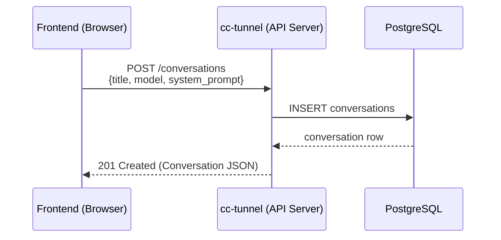
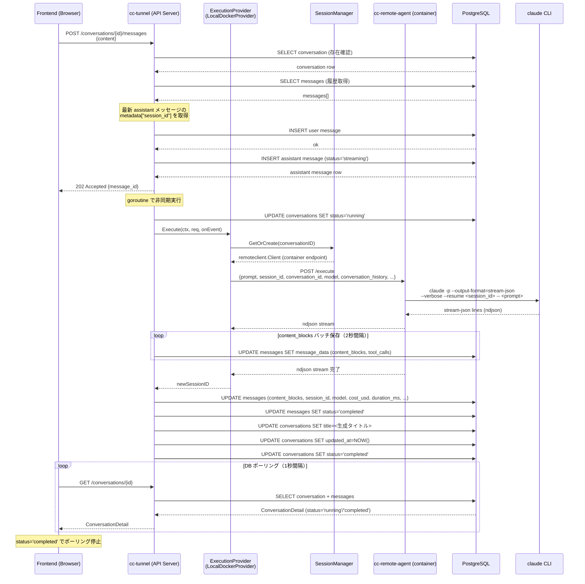
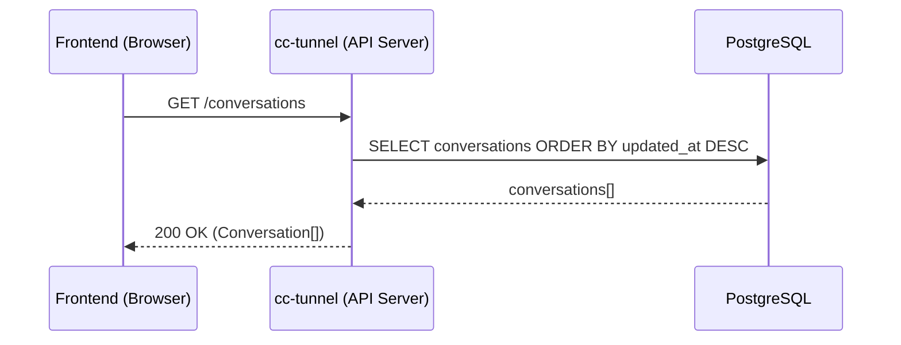
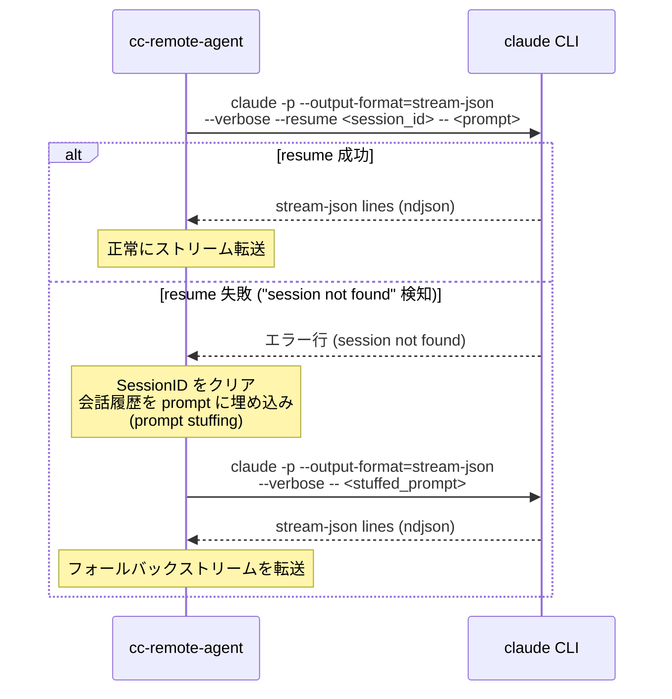

# cc-tunnel シーケンス図

## フロー 1: 会話セッション作成

```mermaid
sequenceDiagram
    participant F as Frontend (Browser)
    participant T as cc-tunnel (API Server)
    participant D as PostgreSQL

    F->>T: POST /conversations<br/>{title, model, system_prompt}
    T->>D: INSERT conversations
    D-->>T: conversation row
    T-->>F: 201 Created (Conversation JSON)
```

## フロー 2: メッセージ送信（非同期処理 + DB ポーリング）

```mermaid
sequenceDiagram
    participant F as Frontend (Browser)
    participant T as cc-tunnel (API Server)
    participant P as ExecutionProvider<br/>(LocalDockerProvider)
    participant SM as SessionManager
    participant A as cc-remote-agent (container)
    participant D as PostgreSQL
    participant C as claude CLI

    F->>T: POST /conversations/{id}/messages<br/>{content}
    T->>D: SELECT conversation (存在確認)
    D-->>T: conversation row
    T->>D: SELECT messages (履歴取得)
    D-->>T: messages[]
    Note over T: 最新 assistant メッセージの<br/>metadata["session_id"] を取得
    T->>D: INSERT user message
    D-->>T: ok
    T->>D: INSERT assistant message (status='streaming')
    D-->>T: assistant message row
    T-->>F: 202 Accepted {message_id}

    Note over T: goroutine で非同期実行

    T->>D: UPDATE conversations SET status='running'
    T->>P: Execute(ctx, req, onEvent)
    P->>SM: GetOrCreate(conversationID)
    SM-->>P: remoteclient.Client (container endpoint)
    P->>A: POST /execute<br/>{prompt, session_id, conversation_id, model, conversation_history, ...}
    A->>C: claude -p --output-format=stream-json<br/>--verbose --resume <session_id> -- <prompt>
    C-->>A: stream-json lines (ndjson)
    A-->>P: ndjson stream

    loop content_blocks バッチ保存（2秒間隔）
        T->>D: UPDATE messages SET message_data (content_blocks, tool_calls)
    end

    A-->>P: ndjson stream 完了
    P-->>T: newSessionID
    T->>D: UPDATE messages (content_blocks, session_id, model, cost_usd, duration_ms, ...)
    T->>D: UPDATE messages SET status='completed'
    T->>D: UPDATE conversations SET title=<生成タイトル>
    T->>D: UPDATE conversations SET updated_at=NOW()
    T->>D: UPDATE conversations SET status='completed'

    loop DB ポーリング（1秒間隔）
        F->>T: GET /conversations/{id}
        T->>D: SELECT conversation + messages
        D-->>T: ConversationDetail (status='running'/'completed')
        T-->>F: ConversationDetail
    end
    Note over F: status='completed' でポーリング停止
```

## フロー 3: 会話一覧取得

```mermaid
sequenceDiagram
    participant F as Frontend (Browser)
    participant T as cc-tunnel (API Server)
    participant D as PostgreSQL

    F->>T: GET /conversations
    T->>D: SELECT conversations ORDER BY updated_at DESC
    D-->>T: conversations[]
    T-->>F: 200 OK (Conversation[])
```

## フロー 4: --resume フォールバック分岐

```mermaid
sequenceDiagram
    participant A as cc-remote-agent
    participant C as claude CLI

    A->>C: claude -p --output-format=stream-json<br/>--verbose --resume <session_id> -- <prompt>

    alt resume 成功
        C-->>A: stream-json lines (ndjson)
        Note over A: 正常にストリーム転送
    else resume 失敗 ("session not found" 検知)
        C-->>A: エラー行 (session not found)
        Note over A: SessionID をクリア<br/>会話履歴を prompt に埋め込み<br/>(prompt stuffing)
        A->>C: claude -p --output-format=stream-json<br/>--verbose -- <stuffed_prompt>
        C-->>A: stream-json lines (ndjson)
        Note over A: フォールバックストリームを転送
    end
```
