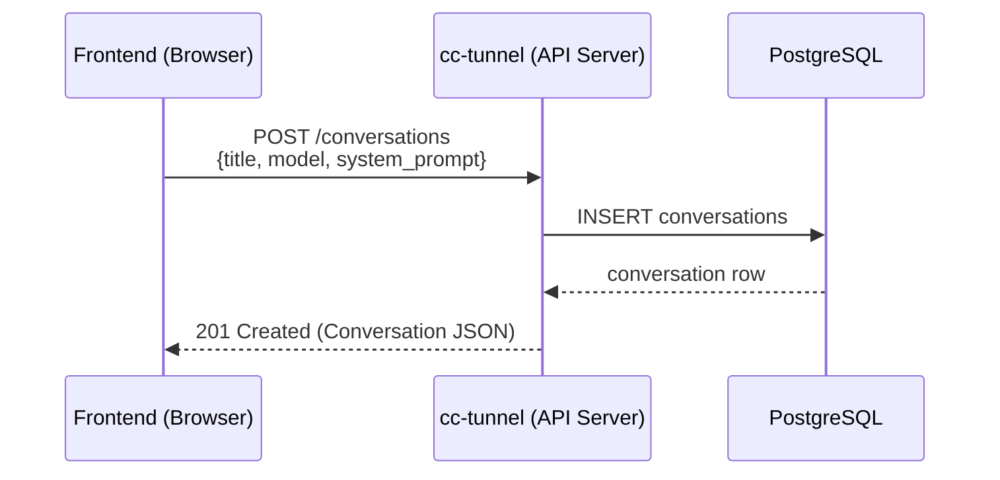
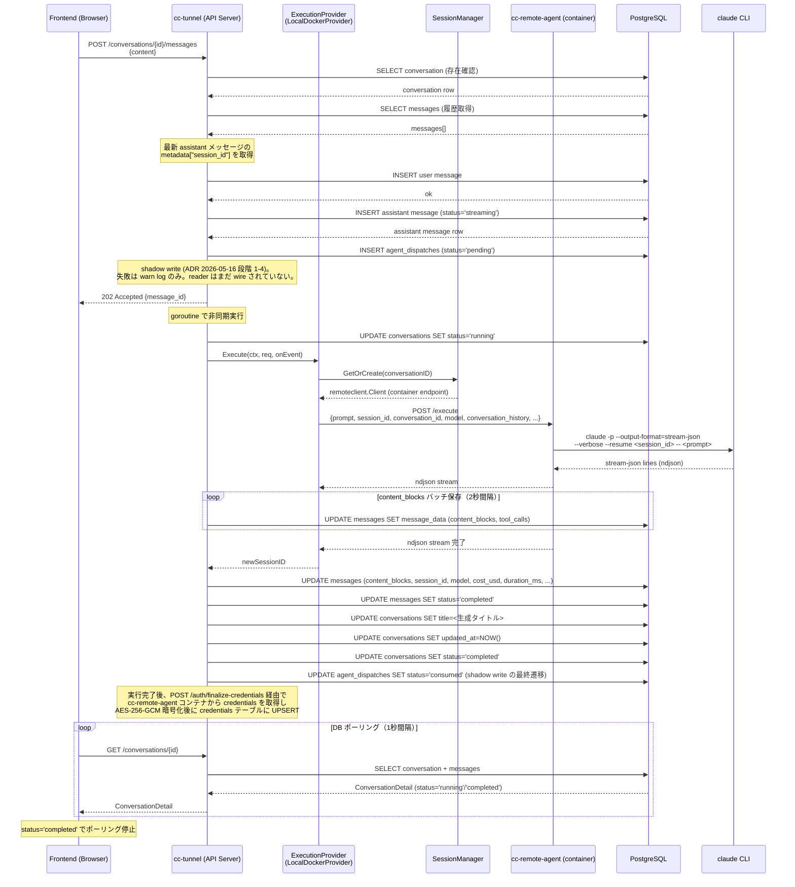
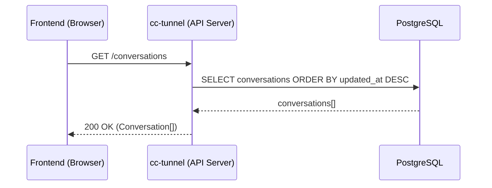
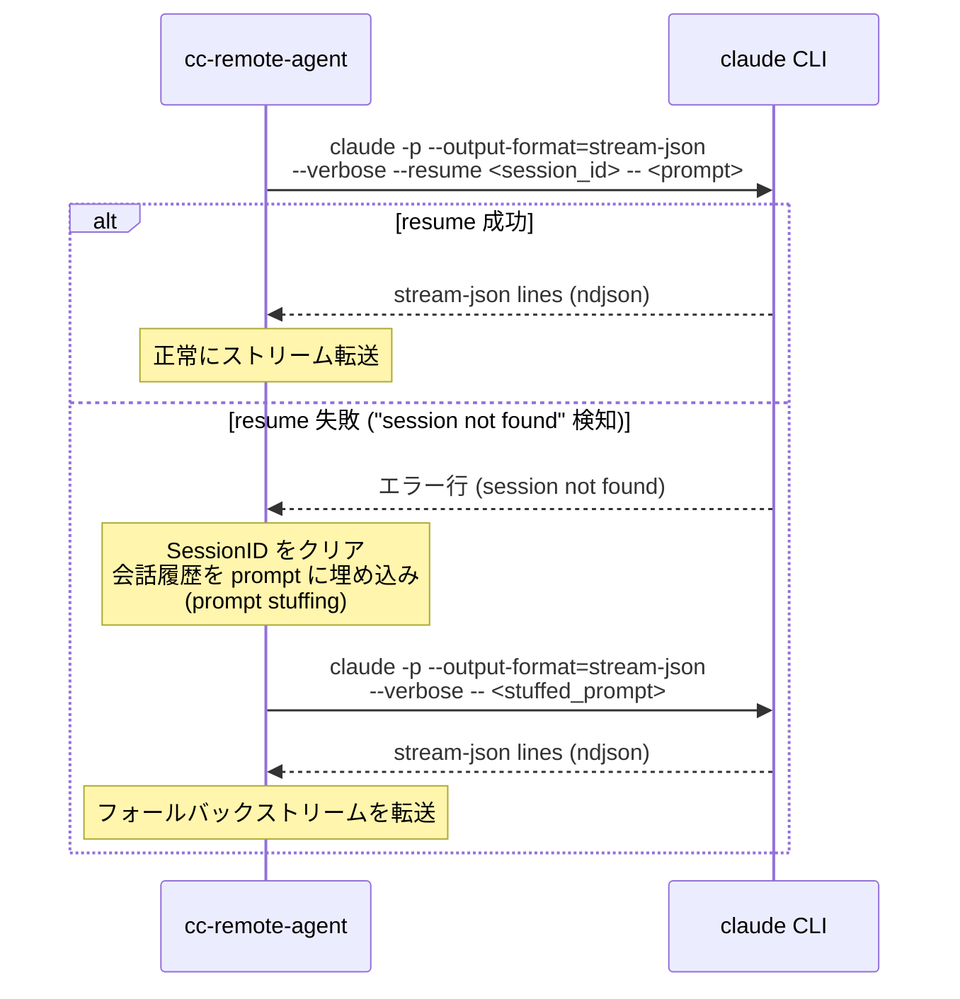
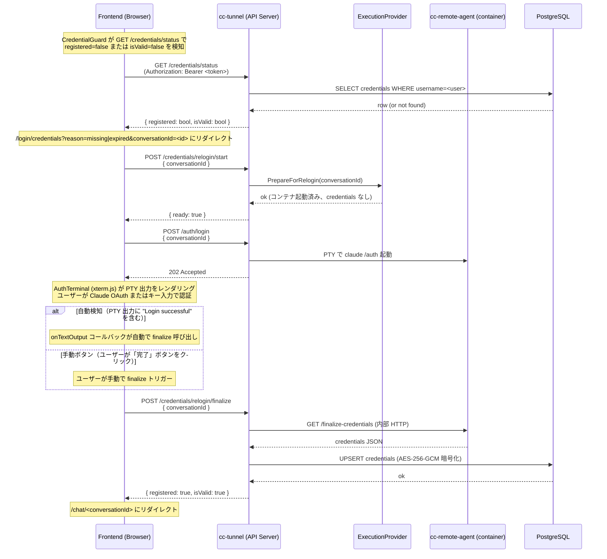
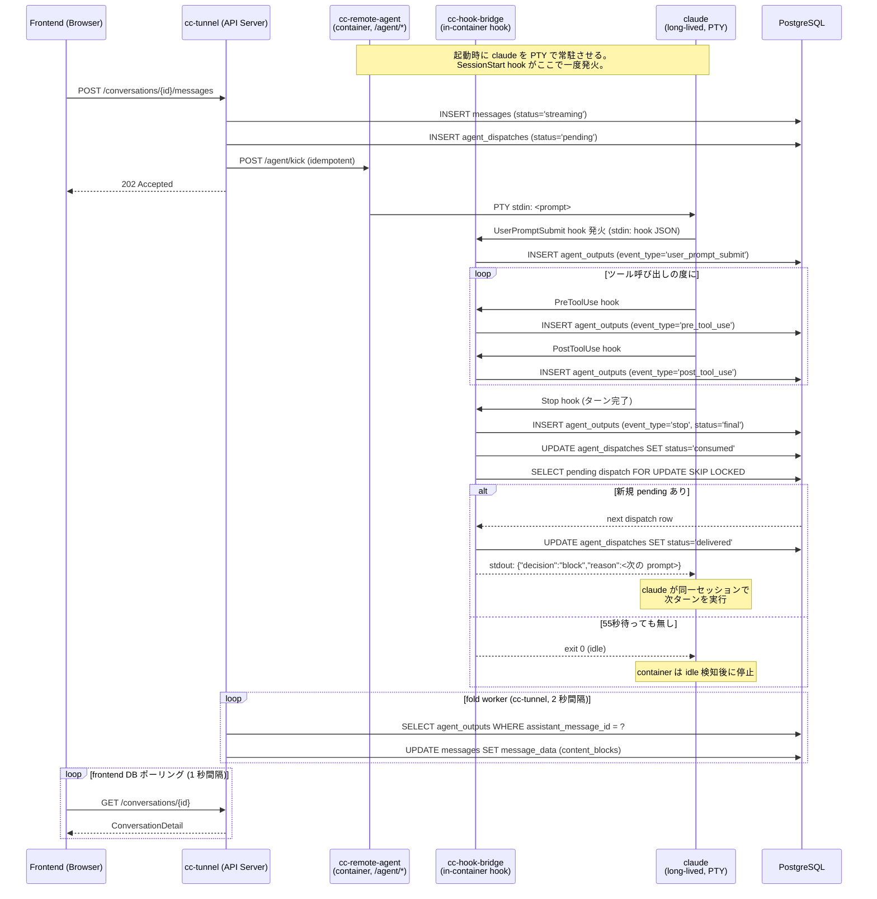

# cc-tunnel シーケンス図

## フロー 1: 会話セッション作成

## フロー 2: メッセージ送信（非同期処理 + DB ポーリング）

## フロー 3: 会話一覧取得

## フロー 4: --resume フォールバック分岐

## フロー 5: Credential Relogin（credentials 再取得フロー）

## フロー 6: hook 駆動 agent 通信 (段階 5-6 で実装予定, ADR 2026-05-16)

PTY 常駐 `claude` プロセスへ Claude Code hook 経由で I/O する将来構成。
本 PR (段階 1-4) では `agent_dispatches` への shadow write のみ実装されており、
**この sequence は段階 5-6 が wire された後に有効**。

